# 基於 WGAN-GP 的字體風格遷移研究
## 摘要

本研究動機來自如何解決個人化中文字體生成門檻過高的問題，提出一套基於 WGAN-GP 的少樣本字體風格遷移架構，解決傳統生成對抗網路（GAN）容易發生的模式崩塌的問題。研究核心發現有三，首先我們再次證實了同步變換增強能有效地利用漢字部件重複的特性，提升模型對陌生字符的泛化能力。其次針對瓶頸層尺寸對生成效果之影響，本研究透過 t-SNE 與 Linear Probe 探針實驗提出了完整的分析並得出最佳尺寸設定。最後則發現了 WGAN-GP 的 Wasserstein 距離能針對文字結構提供穩定的梯度指引，使我們得以移除 L1 像素損失的並生成筆觸更為銳利且結構精準的圖像，相較過往研究對 L1 損失的依賴是值得一提的發現！本研究最終將上述經驗總結套用至中文字體生成，並取得不錯的成果驗證了此架構的潛力，為降低個人化字體製作門檻提供了具實用價值的技術路徑。

## 研究動機

自從 AI 大模型問世造成轟動，我一直對機器學習相關領域有著極大的興趣。在訓練方法上，我尤其對生成對抗網路（Generative Adversarial Network,GAN）的設計著迷。其藉由兩個神經網路（生成器 Generator, 與判別器 Discriminator）進行對抗學習，能有效解決傳統損失函數難以量化圖像「風格」與「真實感」的問題。

近年來，隨著技術的進步以及設計個人化需求的增加，市面上及社群軟體討論中出現了多種英文字體的生成工具（如：Calligraphr、Fontself 等）。透過這些工具，使用者只需手寫 26 個字母及數字，便能自動生成完整的個人化字體。

然在中文漢字領域卻較少看到類似的應用工具，由於漢字筆畫結構複雜、字數龐大等特性，若要求使用者手寫數千個常用字（依照「常用國字標準字體表」約為 5000 字）才能生成字體，實用性將大幅降低。因此，如何透過少量的手寫樣本生成風格一致的完整中文字體，成為了一個值得探索的技術挑戰。

於是我決定嘗試開發一個實用的中文字體生成工具，讓一般使用者也能在僅需要書寫少量文字（目標 1000 字以下）的情況下就能生成屬於自己的字體。

考量到中文字體生成的難度，研究初期將以英文與數字作為實驗對象，深入研究 GAN 以及其衍生架構的運作原理與技術，並嘗試不同的資料處理及增強方式。最終，將英文字集下的實驗結果歸納，進一步應用於未來實作中文字體的生成任務，以降低個人化中文字體的製作門檻。

## 目的

### 1. 建構基於 WGAN-GP 的字體生成模型

探討並實作 WGAN-GP（Wasserstein GAN with Gradient Penalty） 架構，以此解決傳統 GAN 在訓練過程中容易產生的模式崩塌（Mode Collapse）與梯度消失（Gradient Vanishing）問題，建立一個穩定且高品質的字體圖像生成模型。

### 2. 探討資料增強技術對泛化能力以及生成效果之影響

分析不同的數據增強策略（如幾何變換、隨機遮罩）對模型學習成效的影響。本研究將探討在缺乏部分成對訓練資料的情況下，如何透過資料增強處理，幫助模型學習字體的筆畫結構而非單純記憶像素，進而提升對陌生字符的生成品質。

### 3. 分析生成器瓶頸層（Bottleneck）尺寸對生成效果之影響

研究生成器網路中「瓶頸層（Bottleneck）」的特徵圖空間解析度（此研究後續稱為"尺寸"）對輸出結果的影響。探討在資訊壓縮精煉過程中，不同程度的壓縮如何影響生成字體的結構完整性、筆畫細節與風格還原度，並試圖找出最佳的尺寸設定。

### 4. 最佳化損失函數權重配置

探討像素損失（L1 Loss）與對抗損失（Adversarial Loss, adv Loss）之間的權重平衡。分析不同的權重如何影響生成字體的結構完整性、筆畫細節、清晰度等等，解決字體生成中常見的模糊或結構扭曲問題。

### 5. 評估跨語言字體生成之可行性

以英文與數字資料集作為對照，驗證最佳化後的模型架構是否能遷移至結構更為複雜的中文漢字字體生成任務。評估在「少樣本（Few-shot）」情境下，模型是否能依據少量的中文字樣本，推論生成風格一致的其他漢字。

## 設備

### 硬體
#### 模型訓練環境（Google Colab）
- 作業系統：Linux 6.6.105+ x86_64 (glibc 2.35)
- GPU：NVIDIA L4 GPU

#### 本地環境（資料處理與視覺化）
- 作業系統：Windows 10
- GPU：NVIDIA GeForce RTX 3050 Ti Laptop GPU (筆電)

### 軟體
#### 模型訓練環境（Google Colab）
- Python 3.12.12 (colab)
- Pytorch 2.9.0+cu126 (colab)
- PIL 11.0.0 (colab)
#### 本地環境（資料處理與視覺化）
- Python 3.10.0 

## 文獻探討

### 中文字體生成的挑戰與 GAN 技術的應用

中文字體生成面臨著與英文字體截然不同的技術挑戰。首先是字符數量龐大，常用漢字（依照「常用國字標準字體表」）約為 5000 字遠超英文及數字的 62 個字符，使得收集完整的手寫樣本成為極大的挑戰。其次是筆畫結構複雜，對模型的特徵學習能力提出了更高要求。
而傳統的像素級損失函數（如 L1、L2 距離）雖能約束結構相似性，但難以量化字體的「風格真實感」與「筆觸自然度」。生成對抗網路（GAN）的出現為這個問題提供了有效的解決方案。

### 生成對抗網路 (Generative Adversarial Network,GAN)

Ian Goodfellow 等人（2014）[1] 提出此非監督式學習的方法，其架構由一個生成器與一個判別器組成。生成器接受噪聲或是其他輸入，目標是產生近似訓練集中真實樣本的輸出。判別器則同時接收真實樣本與生成器產生輸出，並嘗試區分兩者。透過生成器與判別器之間的對抗式訓練，兩個網路不斷調整參數，最終使生成器能夠生成與訓練資料分佈相近的樣本。
而後，Radford 等人（2015）[2] 提出的 DCGAN (Deep Convolutional GAN) 將卷積神經網路（CNN）結構引入 GAN，發現其能有效地提取到更高層次圖像特徵，大幅提升了訓練的穩定性與生成風格圖像的品質。
### WGAN（Wasserstein GAN）

Arjovsky 等人（2017）[3] 提出 WGAN，指出在原始的 GAN 中，判別器使用 JS 散度（Jensen-Shannon Divergence）作為評分，當生成結果分佈與真實樣本分佈不重疊時梯度無法給出有意義的評分，容易發生模式崩塌（Mode Collapse）等問題。WGAN 即是基於原始的 GAN，修改判別器的評分方式改使用 Earth-Mover（EM,Wasserstein-1）距離來衡量真實分佈與生成分佈的差異。即使兩個分佈不重疊，Wasserstein 距離仍能提供有意義的梯度，引導生成器持續學習。

### WGAN-GP（Wasserstein GAN with Gradient Penalty）

Gulrajani 等人（2017） [4] 提出此改良架構。為了滿足 Wasserstein 距離所需的 1-Lipschitz 連續性限制，WGAN-GP 摒棄了原本 WGAN 直接裁切權重（Weight Clipping）的做法（該做法易導致參數兩極化），改為在損失函數中加入梯度懲罰項，確保判別器的梯度範數維持在 1 附近，顯著提升了訓練的穩定性與收斂速度。故本研究選擇其作為模型基礎架構。

### Pix2pix （Image-to-ImageTranslationwithConditionalAdversarialNetworks）

Isola 等人（2017） [5] 提出 Pix2pix，這是一種條件式生成對抗網路（Conditional GAN, CGAN）。不同於傳統 GAN 僅透過隨機噪聲生成圖像，該模型依據輸入的圖片進行生成，故可用於圖像和圖像之間的映射。該研究其中一個特色是 U-Net 結構，即將模型第 i 層的特徵圖直接傳遞至第 n-i 層，確保輸入圖片的不同維度資訊不會流失。其另一特色則是結合對抗損失與 L1 損失（L1 Loss）以維持風格與結構，此兩項損失之間的平衡權重，亦是本研究要討論的一個參數。

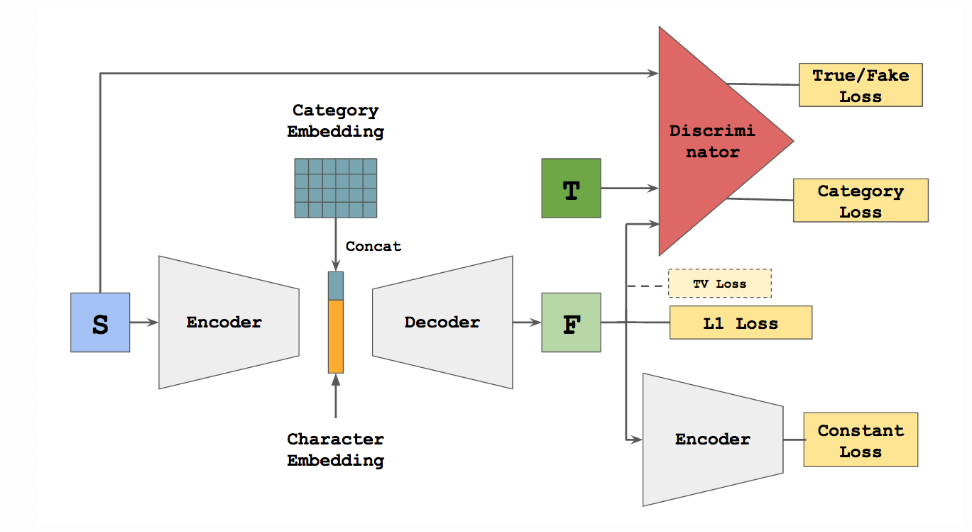

### [zi2zi](https://kaonashi-tyc.github.io/2017/04/06/zi2zi.html)（Master Chinese Calligraphy with Conditional Adversarial Networks）

Tian（2017） [6] 發布的 zi2zi 開源專案，是一個將 pix2pix 應用在中文字體生成的實踐。其特點是引入了類別嵌入（Category Embedding），使字形的配對不侷限在兩字體對應，而是將大量字體作為預訓練資料使模型能學到多種字體的風格映射。
不過本研究則回歸到將字體生成視為一個一對一的風格轉換任務，並沒有依賴預訓練資料對模型進行訓練。

### [Handwritten Chinese Font Generation with Collaborative Stroke Refinement](https://openaccess.thecvf.com/content/WACV2021/papers/Wen_Handwritten_Chinese_Font_Generation_With_Collaborative_Stroke_Refinement_WACV_2021_paper.pdf)

Wen 等人（2021）[7] 提出了此一協同筆畫細化（Collaborative Stroke Refinement）的生成架構，該研究引入了粗體分支解決過細的筆劃容易在訓練過程丟失的問題。為了複用中文字中的重複結構，更提出了線上縮放增廣策略（Online Zoom-Augmentation Strategy），透過預先設定的動態縮放與平移操作，使模型能在特定的部首出現在不同位置時皆能有好的效果，將微調用資料降低至 750 個字符。Chen 等人（2022）[8] 改良的 DG Font++ 也使用了類似的增強變換方法，本研究的同步變換增強即是參考自此二篇研究。

### 小結

本研究考慮到 GAN 在圖像生成的優勢以及他的不穩定性，決定使用 WGAN-GP 這個較為穩定的架構進行實作。並參考前人的研究，借鑒了 Pix2pix 的編解碼器以及雙損失函數（L1 損失 & 對抗損失）架構，但為了簡化模型複雜度並聚焦於 WGAN-GP 本身的潛力探討，選擇不採用 U-Net 的跳躍連接機制。另外也在 zi2zi 中看見了中文字體生成的可行性，但選擇將字體生成聚焦為一對一的風格轉換，不透過預訓練資料進行模型訓練。最後則從 Wen 等人（2021）[7] 的研究中得到了同步變換增強的參考，並嘗試加入了旋轉及遮罩等操作。

## 方法及過程

### 研究流程

1. 資料集生成製作
2. 以數字做嘗試，建立可用的 WGAN-GP 架構
3. 引入英文字母，並透過 GAN 文獻經驗尋找效果恰當的超參數
4. 針對不同的研究目標（資料處理/瓶頸層/損失權重），控制其他變因進行實驗
5. 針對相同的目標，使用不同字體進行實驗
6. 總結上述實驗並應用至中文字體生成
7. 分析各實驗結果並做結論
   

### 生成字體評估標準
由於字體生成任務的結果較難單純比較像素相似度做評分，仍須考量整體字符風格以及是否能夠辨識等等問題，本研究主要依據以下三個方向進行視覺評估：
#### 1. **結構完整性**
- 字符的基本骨架是否正確（例如 'A' 的三角形結構、'8' 的雙圓結構）
- 是否出現筆畫缺失或錯位
- 是否發生身份混淆（Character Identity Confusion），例如將 'U' 生成為 '0'、'3'生成為 '2'
#### 2. **風格一致性**
- 是否保留了目標字體的特徵筆觸（襯線等）
- 轉折處是否圓滑或銳利（取決於目標字體風格）
- 橫豎筆畫的粗細變化是否自然
- 生成字體是否在視覺上接近目標字體風格
#### 3. **清晰度**
- 筆畫邊緣是否清晰,是否出現模糊 (Blurry) 現象
- 是否有雜訊或不必要的像素點

### 資料來源與處理

#### 字體來源

本研究選用以下字體，其挑選原則為盡量包含多種風格，且變化程度從低到高皆有包含為主。
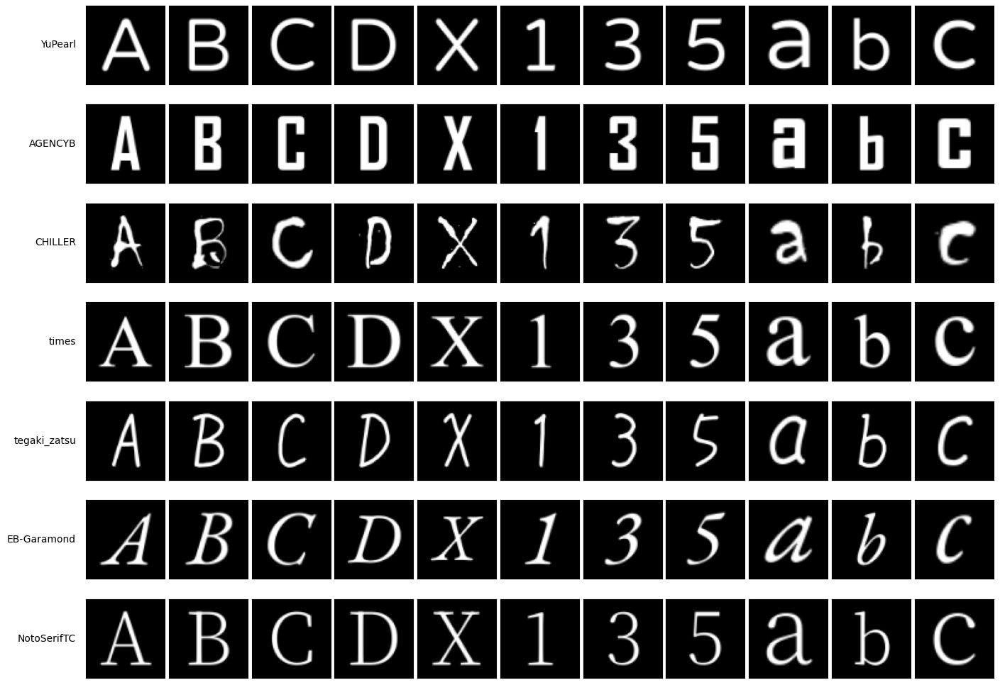

#### 資料集產生

讀取來源字體和目標字體後，透過 pillow 套件繪製於畫布上，將其縮放至 64×64 的尺寸，並調整為背景黑色、文字白色的灰度圖，並經過同步變換增強後生成一個一一對應的資料集。

#### 主動分割測試集

為了驗證模型的泛化能力並避免過度擬合（Overfitting）本研究也主動將字符集劃分為「訓練集」與「測試集」。訓練階段僅使用特定的字符（如主動移除資料集中的 A、E、I、G、Z 等隨機字符），以模擬中文資料集不會包含所有文字的情況，並用以評估模型是否真正學會了「風格遷移」而非單純記憶圖像。

#### 動態生成機制

本研究的資料集使用動態生成 (On-the-fly Generation) 而非預先將訓練資料儲存成靜態圖片。在訓練時時透過 `__getitem__` 動態渲染。此機制不僅大幅節省硬碟空間，更允許在每一個 Epoch 對同一字符施加不同的隨機增強效果，使模型在整個訓練週期中從未看過完全相同的兩張圖片，相比預先生成所有資料並在每一輪重複讀取資料量大幅提升資料量。

### 模型架構

本研究建立了一個基於 WGAN-GP 的生成對抗網路架構，旨在解決傳統 GAN 在訓練時常見的梯度消失以及模式崩塌（Mode Collapse）等問題，整體架構分為生成器（Generator）與判別器（Discriminator）兩大核心組件，詳細設計如下：

#### 1. 生成器（Generator）

生成器採用「編碼器-解碼器 (Encoder-Decoder) 結構」，目的在於學習從來源字體圖像（$I_s$）到目標字體圖像（$I_t$）的非線性映射。

##### 編碼器（Encoder）

由多層卷積層（Convolutional Layers）組成。每一層進行下採樣（Downsampling），逐步壓縮特徵圖的空間解析度（Spatial Resolution）並增加特徵通道數（Channels），並使用 Leaky ReLU 作為激活函數（負斜率 α=0.2），相較於 ReLU 能避免「死神經元」問題。此過程旨在提取字體的筆畫結構與幾何特徵。

##### 可變的瓶頸層（Adjustable Bottleneck）

編碼器後連接瓶頸層，其指的是經過編碼器壓縮後的潛在空間。本研究則將此層的尺寸（n×n）設為可調整的變因，將在後續進行討論。此外，為了使生成器有更大的操作空間避免模型僅依賴來源字體特徵無法進行較難的風格變換，我們在此層將同樣大小的高斯噪聲張量 z 與特徵進行拼接（Concatenation）。

##### 解碼器（Decoder）

由多層轉置卷積層（Transposed Convolution）組成。將瓶頸層的特徵圖逐步上採樣（Upsampling）回原始圖像大小。層與層之間採用 ReLU 激活函數以取得更明確的特徵也避免噪點出現，最後一層經由 Sigmoid 函數映射至 [0,1] 區間最終輸出 64×64x1 的灰階圖像。

#### 2. 判別器（Discriminator）

使用標準的 WGAN-GP 判別器，由 5 層卷積層將 64×64 下採樣至 1×1，最後一層設計為不使用激活函數直接輸出純量分數（Scalar Score），代表輸入樣本與真實分佈的 Wasserstein 距離估計值。
並在損失函數中加入梯度懲罰項 （Gradient Penalty），約束真實樣本與生成樣本插值點的梯度範數維持在 1 附近，確保 1-Lipschitz 連續性。[4]

#### 整體架構流程
完整的訓練流程如下：
1. 來源字體圖像 $I_{raw-s}$ 與目標字體圖像 $I_{raw-t}$ 經過 同步變換增強（詳見後續章節）得到 $I_s$ ​ 與 $I_t$
2. $I_s$ 輸入生成器編碼器，壓縮至 n×n 的瓶頸層特徵（詳見後續章節）
3. 在瓶頸層嵌入高斯噪聲 z 並拼接
4. 解碼器將融合特徵上採樣，生成目標字體 $\hat{I}_t = G(I_s,z)$
5. 判別器接收$\hat{I}_t$​ 與 $I_t$，計算對抗損失 $\mathcal{L}_{adv}$
6. 同時計算生成圖像與真實目標的 L1 距離 $\mathcal{L}_{L1}$
7. 總損失 $\mathcal{L}_{Total}$ 由兩者加權組合（詳見後續章節），指導生成器參數更新

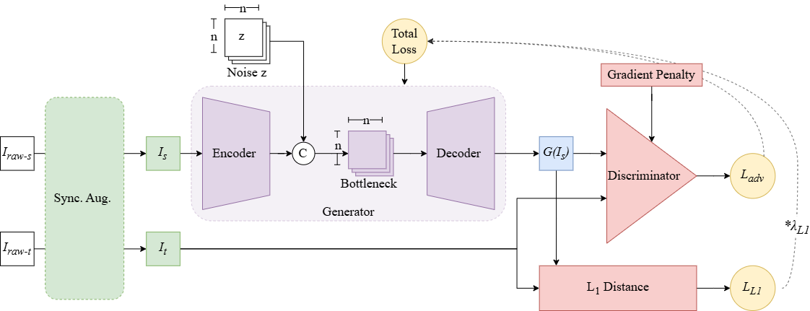

### 同步變換增強

#### 幾何變換

考量手寫字體在真實書寫時具有高度的隨機性，本研究引參考 Wen 等人（2021）[7] 的增強操作並新增了旋轉以及遮罩增強。其關鍵在於採用同步變換操作，即對來源圖與目標圖施加完全相同的變換參數，以維持兩者結構的對應關係。此操作由以下參數配置：

##### 1. 縮放 (Scaling)：
模擬字體大小的變化，其值為一個數對（$S_{min}, S_{max}$）代表隨機縮放的最小和最大比例。
##### 2. 平移 (Translation)：
模擬文字在方格內的位置偏移，其值為一個數對（$T_x,T_y$），代表圖片在 x 和 y 軸的最大偏移比例（相對圖片尺寸，例如偏移 0.5 即代表偏移畫布寬度的一半）。
##### 3. 旋轉 (Rotation)：
模擬書寫時的傾斜角度，其值為一個正數（$θ$）代表旋轉範圍（$±θ$ 度）。

透過幾何增強，預期能擴增可用的數據量，讓模型遇到類似的結構能夠套用經驗，也避免過擬合現象發生。

同步變換增強示意圖

#### 隨機遮罩
為了增強可用的資料量，本研究從去噪自動編碼器（Denoising Autoencoder）得到靈感，加入隨機遮罩機制。在訓練過程中，以固定機率 $P_{mask}$ 對輸入圖像及目標圖像隨機遮蔽一塊矩形區域（將像素值設為背景色），此舉目標同樣是為了讓缺少的資料能有更多樣的變化。

隨機遮罩示意圖

### 可變的瓶頸層

在最經典的生成模型架構如 DCGAN [2] 中，研究者通常會將輸入資訊壓縮為一個不具空間維度的潛在向量（Latent Vector，即空間解析度為 1×1） ，例如 Pathak 等人（2016）[9] 在 Context encoders 這篇研究中將輸入壓平成長度 4000 的向量。

不過後續其他研究也使用了非 1×1 的瓶頸層不過其尺寸選擇各有不同，舉例來說 Lee 等人（2024）[10] 在 RAC-Font 這篇研究中將 64×64 的輸入壓縮至 16×16。 Zeng 等人（2021）[11] 在 StrokeGAN 這篇研究中將 128×128×3 的輸入壓縮至 32×32×256。DG Font++[8] 則將 128×128 的圖片壓縮至 16×16。

這些研究受其架構差異，瓶頸層尺寸各有不同，故本研究也選擇將瓶頸層尺寸設為實驗變因，探討在 n×n （n=1,2,4,8,16）的尺寸設定下對生成品質的影響。

#### 模型架構一致性（控制變因）

在模型的控制變因上，本研究遵守「架構一致性策略（Architectural Consistency）」，亦即固定模型的卷積層數，並依照相同的下採樣邏輯（當空間解析度隨下採樣減半時，特徵通道數（Channels）相應翻倍，持續下採樣直到瓶頸層尺寸達到目標尺寸後不再下採樣。

註：瓶頸層實際形狀為「寬×高×通道數」，本研究關心的是其中的「寬×高」也就是所謂的「空間解析度」由於下採樣邏輯相同，決定瓶頸層的空間解析度可知道其通道數，故將空間解析度統一稱為「尺寸」並且不特別標註通道數。

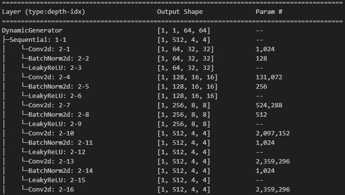
卷積模型 Encoder 架構，以 n=4 為例，其經過四次下採樣後即不再下採樣

#### 參數量差異

此架構雖已經盡量保持一致，但模型在參數量仍有不同，以下附上各瓶頸層尺寸的模型生成器的參數量（Parameters）。

| Bottleneck size | Trainable params (Generator) |
| --------------- | ---------------------------- |
| 1×1             | 17,432,272                   |
| 2×2             | 20,889,120                   |
| 4×4             | 24,291,008                   |
| 8×8             | 28,389,888                   |
| 16×16           | 13,741,440                   |

### 損失函數設計

為了兼顧生成圖像的風格真實感與文字結構的正確性，本研究參考前人研究，令生成器 $G$ 的總損失函數 $\mathcal{L}_{G}$ 由對抗損失與像素重建損失兩部分加權組成。

#### 1. 對抗損失 (Adversarial Loss)

對於生成器而言，其目標是最小化生成圖像被判別器 （Discriminator,D）評分為「假」的程度（即最大化判別器分數）。其損失函數定義為：
$$ \mathcal{L}_{\text{adv}} = -\mathbb{E}_{z, I{s}} [D(G(z, I_{s}))] $$
其中，$z$ 為隨機噪聲，$I_{s}$ 為來源字體圖像，$G(z, I_{s})$ 為生成的偽造圖像。

註：為了維持 WGAN 的 1-Lipschitz 限制，判別器 $D$ 的訓練過程額外包含梯度懲罰項 （Gradient Penalty），其完整損失為 $\mathcal{L}_{D} = \mathbb{E}[D(G(z, I_{s}))] - \mathbb{E}[D(I_{t})] + \lambda_{gp}\mathbb{E}[(||\nabla_{\hat{x}} D(\hat{x})||_2 - 1)^2]$。

#### 2. L1 像素重建損失 (L1 Reconstruction Loss)

為了確保生成的文字在筆畫結構與空間位置上與目標字體保持一致，且避免模型僅追求抽象的風格相似，引入 L1 距離作為內容約束。此項計算生成圖像與真實目標圖像 $I_{t}$ 之間像素值的絕對誤差平均值：
$$ \mathcal{L}_{\text{L1}} = \mathbb{E}_{I_{s}, I_{t}} [ || G(z, I_{s}) - I_{t} ||_1 ] $$
依據前人研究，此損失項能提供明確的梯度指引，加速模型收斂並防止字形嚴重扭曲。[5]

#### 3. 總目標函數 (Total Objective Function)

綜合上述兩項，生成器的總損失函數定義如下：
$$ \mathcal{L}_{\text{Total}} = \mathcal{L}_{\text{adv}} + \lambda_{L1} \cdot \mathcal{L}_{\text{L1}} $$
其中，$\lambda_{L1}$ 為權重超參數（Hyperparameter），用於調節「風格遷移（由 $\mathcal{L}_{\text{adv}}$ 主導）」與「內容保留（由 $\mathcal{L}_{\text{L1}}$ 主導）」之間的平衡。[5]

## 實驗結果與討論

### 訓練及生成結果
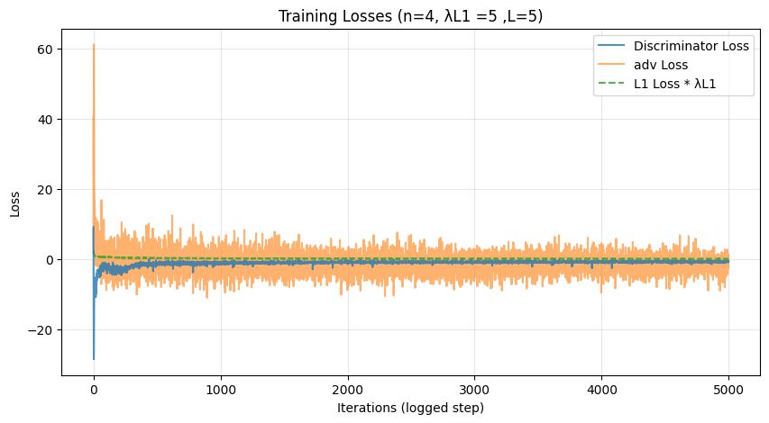
依據訓練過程的損失曲線顯示，L1 損失（L1 Loss）在訓練初期迅速下降並趨近於 0，其收斂速度顯著快於對抗損失，且其值就算經過加權後相較生成對抗損失（adv Loss）仍非常小，這暗示其對訓練結果的影響可能有限，我們將於後方章節討論。
對於 WGAN-GP 關鍵的對抗損失則可見判別器損失（Discriminator Loss）迅速下降至 -30 後回升並穩定維持在 -1 左右的負值區間。這符合 WGAN 的理論預期，代表判別器成功在滿足 Lipschitz 限制的前提下，找到了衡量真實與生成分佈差異的穩定標準（Wasserstein Distance），並持續提供有效梯度。而生成對抗損失（adv Loss）收斂後仍持續震盪，並以較緩慢的速度降低幅度最終仍無法穩定至特定值但此時生成結果已經符合預期。

相較之下若使用傳統的 GAN 則較容易出現模式崩潰的現象，且生成結果會出現偏灰的情況除此之外其效果也較 WGAN-GP 差。

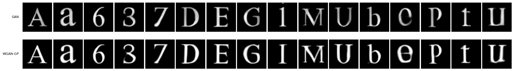

總結來說我們成功的搭建了基於 WGAN-GP 的穩定框架，其在各字體的生成效果如下。

模型在訓練集（圖片中靠左的 3 個字符為例）中在三個評估方向（結構完整、風格一致、清晰度）皆能完美模仿目標字體。在測試集中則受不同字符、字體的影響效果略有差異，不過只有部分字符（'Ｍ'、'ｅ'等）會出現結構上的錯誤，風格一致性方面各自體皆表現優秀。至於清晰度則沒有發現可見的噪點，不過在部分字符則會出現模糊現象。

### 同步變換增強對泛化能力以及生成效果的影響

如下圖，縮放變換在一定的範圍有正面影響，但若放大過大導致資料中白色色塊過大會導致生成效果不佳出現結構不精準的情況。而縮放倍率太小則會造成太細的筆劃容易被忽略。

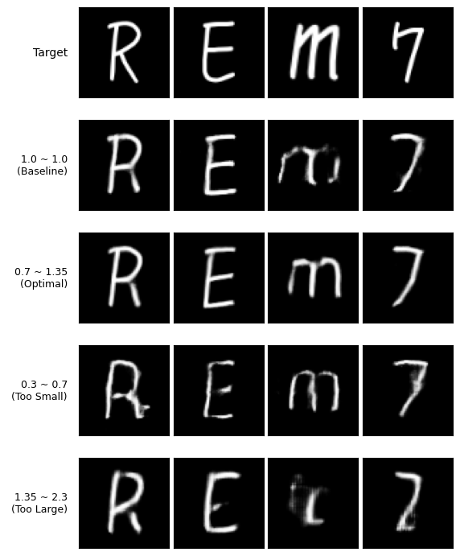

平移變換的結果與縮放類似，在合理範圍皆能顯著提高生成結果，但若移動後導致字符過多的部分被裁切形成無用數據也會帶來負面影響。

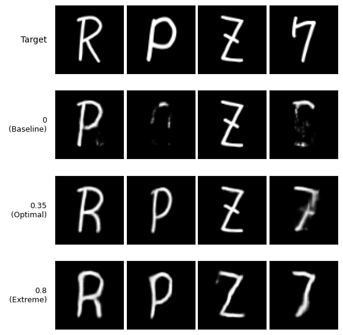

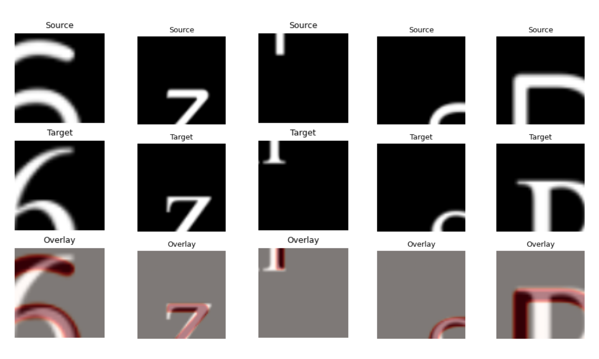
無用數據示意圖

旋轉變換的效果是不顯著的，在多數情況甚至會帶來負面影響，其原因應該是因為兩種字型之間偏移的方向理論上是固定的（例如目標字型筆畫收尾會往上偏）但在旋轉後會使得訓練資料中有些筆畫末端轉為偏左或偏右，推測這種矛盾的現象會帶來負面影響。
另外部分字體有橫向筆畫較細，直向筆畫較粗的特性，此時若加入旋轉也可能會導致模型混淆橫豎筆畫的粗細關係。

對於隨機遮罩增強，結果顯示其在所有測試字體中皆導致生成品質下降。原因應是模型誤將遮罩截斷的地方視為筆畫末端進而影響模型對於筆畫收尾方式的理解，或是因為兩字體的偏移導致遮罩僅遮住其中一字體，發生生成的字筆畫嚴重缺失的情況。

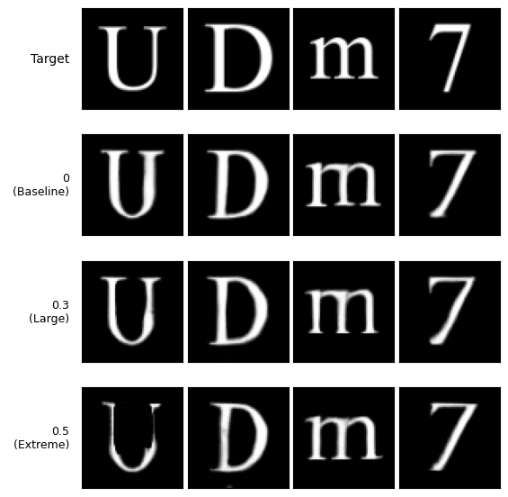

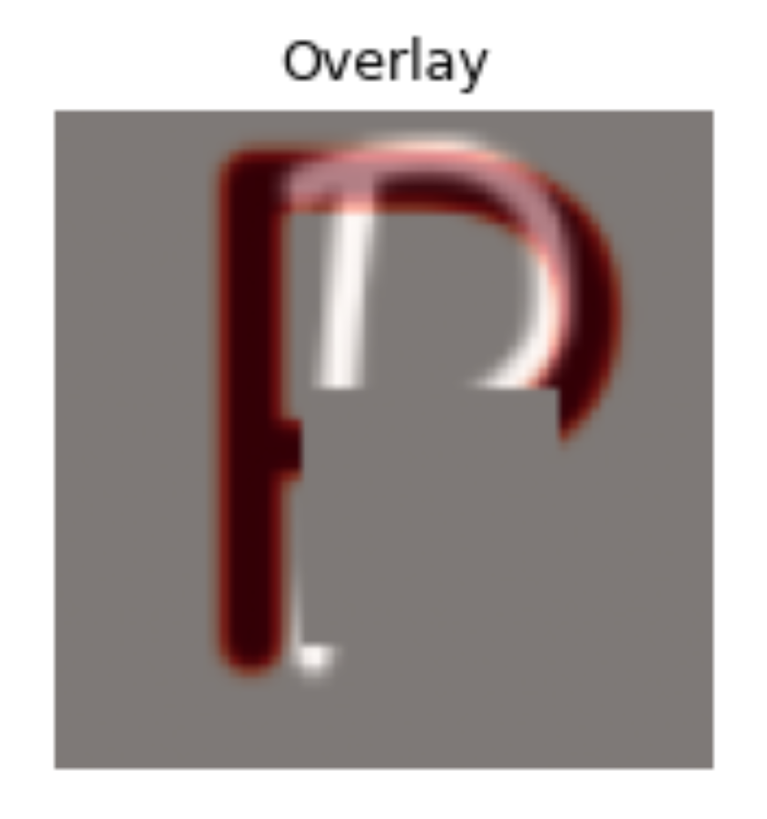
錯誤遮罩示意圖。
這兩項具負面效果的變換在 Wen 等人（2021）[7] 的研究並未使用，可能同樣是該研究者經過實驗後的結果。而 DG Font++ [8] 的架構雖有使用但其將結構與風格做分離，僅將增強應用至風格分支故沒有出現此負面影響。

### 瓶頸層尺寸對生成效果之影響

本研究測試了 1×1 至 16×16 等多種解析度。發現到1×1的瓶頸層會導致模型失去對結構的理解，在前兩組字體中甚至出現了結構錯誤以及身份混淆的現象。而實驗結果顯示 4×4 及 8×8 的尺寸達到了最佳平衡點。它既能有效地進行特徵抽象化（Feature Abstraction），又能保留必要的空間位置資訊（Spatial Correspondence）。

| Bottleneck size | SSIM 1   | LPIPS 1   | SSIM 3   | LPIPS 3   |
| --------------- | -------- | --------- | -------- | --------- |
| 1×1             | 0.632781 | 0.273777  | 0.736075 | 0.160062  |
| 2×2             | 0.778617 | 0.117102  | 0.751457 | 0.129034  |
| 4×4             | 0.823639 | 0.0795462 | 0.783361 | 0.103352  |
| 8×8             | 0.826663 | 0.0730726 | 0.780685 | 0.100184  |
| 16×16           | 0.816338 | 0.0723652 | 0.777152 | 0.0997268 |

為了客觀驗證此發現，本研究嘗試透過一系列實驗，深入分析瓶頸層的空間保留能力，並解釋 1×1 架構在結構生成上失效的根本原因。

#### 瓶頸層特徵視覺化

首先，我們直接將瓶頸層輸出的特徵圖進行視覺化。

可見瓶頸層的特徵圖呈現類似雜訊的分佈，無法直接辨識出與字符結構的關聯。這說明了深層卷積網路已將輸入圖像編碼為高度抽象的特徵（Abstract Features），導致我們無法直接解讀其中的空間對應關係。
#### 瓶頸層遮蔽測試

我們進行人為遮蔽測試，在訓練完畢後遮蔽瓶頸層的部分區塊並生成字體圖片，藉此確認 n>1 時瓶頸層是否攜帶了字體筆畫的位置資訊。

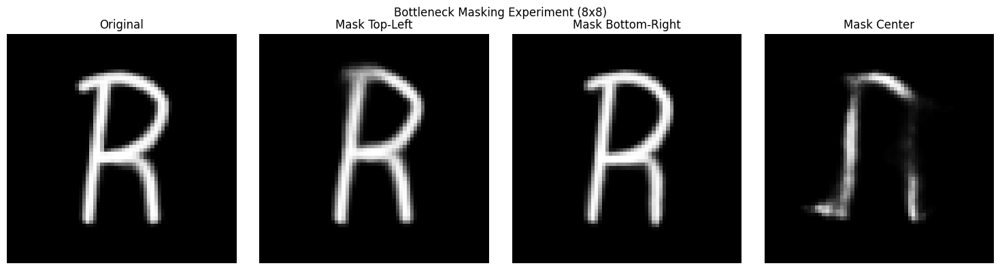

結果顯示 n>1 時，瓶頸層確實攜帶了明顯的位置資訊，不過其攜帶的位置解析度及範圍在 n=2 及 n=8 的情況並沒有明顯差異。

#### 特徵降維分群測試

參考 Goldfeld 等人（2020）在 The Information Bottleneck Problem and Its Applications in Machine Learning [12] 這篇研究的觀點，其認為在神經網路中「壓縮」會反映到資料在空間中的類聚現象。我們推測是 1×1 的瓶頸層過度壓縮了圖片，導致資訊缺失，故選擇採用 t-SNE（t-Distributed Stochastic Neighbor Embedding）降維技術對特徵做處理，此工具能夠將高維度的特徵向量映射至二維平面，並保持樣本間的局部鄰近關係。

具體而言，我們將生成器瓶頸層輸出的 n×n×C 特徵圖展平（Flatten），透過 t-SNE 投影後觀察不同字符的特徵分佈。若同一字符的樣本在二維平面上能夠聚集成簇（Cluster）且不同簇有明顯分隔，則代表模型成功學會了區分不同字符的特徵。反之若雜亂無章，則代表資訊在壓縮過程中流失過多。

#### 線性探針測試

為了進一步量化模型對「幾何結構」的理解，我們引入了 Linear Probe 測試。此方法常用於自監督學習，旨在探測凍結的特徵層中是否隱含了顯性的空間資訊。
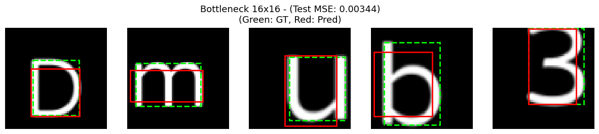

具體而言，我們凍結（Freeze）生成器的編碼器所有參數，並在其瓶頸層後附加一個簡單的線性回歸層（Linear Layer）並進行訓練。該探針的任務是僅憑瓶頸層特徵，預測輸入字體的邊界框座標（Bounding Box, $[x_{min},y_{min},x_{max},y_{max}]$ )
若此線性層能夠準確預測出文字的位置與大小（即驗證集 MSE 誤差低），則說明瓶頸層中確實保留了一定的空間幾何資訊（Spatial Information）。反之若誤差較高，則說明空間資訊在壓縮過程中被破壞。

#### 測試結果

依據特徵視覺化以及遮蔽測試的觀察可做出「瓶頸層的確在把輸入壓縮提取特徵時攜帶了一定的位置資訊」，在此基礎上進一步解釋分群實驗以及 linear probe 測試，可做出以下分析：
##### 1. 部分字體在瓶頸層為 1×1 時失效之原因

對於在生成結果出現的字符結構錯誤甚至身份混淆的前兩個字體中（以第一張分析圖做代表），可對應到其 t-SNE 分群中 n=1 時的大部分分群失效的情況，分群圖中左側的資訊點皆無法分類。
而在 linear probe 測試中也能發現其 MSE 值也是略高的，這足以說明在前兩組字體中 1×1 的瓶頸層造成的「資訊過度壓縮以及省略」是導致其生成效果非常的不理想的原因。

##### 2. 過大的瓶頸層尺寸（n>8）的負面影響

當瓶頸層過大（n>8）其分群效果較差，分群交界較不明顯，且相同資料出現了分群不同的現象（同顏色資料點出現多於一個族群），推測其原因是過大的瓶頸層沒辦法確實的提取出不同字符的關鍵資訊導致過多的雜訊出現。在 Linear Probe 測試中則出現過擬合現象，同樣說明了其雖然保留了較多結構（在訓練集 MSE 極小）但並沒有確實的將資訊精煉成利於後續操作的特徵（其測試集 MSE 極大）。總結來說當 n>8 時，模型比較像是依賴輸入筆畫的完整結構保留來輸出結構正確的圖像，但在風格以及筆畫的變換上效果不如 n≤8 的瓶頸層。

##### 3. 解釋兩項測試與實際生成效果出現的部分矛盾

對於第三組字體（第二張分析圖）來說，1×1 的瓶頸層並沒有帶來明顯的結構錯誤，對應的其分群效果和 linear probe 測試成績也是比較好的。比較其他字體也能發現，在不導致過度壓縮的前提下，越小的瓶頸層能在這兩項測試取得較好成績，不過這卻與生成效果在 n=4 及 n=8 才有最優表現的現象不符。針對此矛盾，本研究提出以下解釋：

Linear Probe 測試中，邊界框（Bounding Box）僅代表文字的「粗略位置」，回歸層能容易的從 2×2 的特徵層提取出這個低維度的的特徵（也可從空間資訊遮蔽測試得知）。同樣的， t-SNE 測試中最終只需要歸類為 2 個維度（軸向）來區分字符，這對 2×2 的瓶頸層來說應也是容易且較少干擾的。

不過當任務回到「生成精細字體」時，4×4 或 8×8 的特徵中本來成為干擾的高頻筆畫細節資訊，得以在更深層的解碼器還原下，協助生成出筆觸自然、結構完整的字體。也就是說，過小的瓶頸層雖能精煉出一定的位置資訊，但仍捨去了部分對生成字體有幫助的高頻細節。這與 RAC-Font [10] 中提出的解釋不謀而合。
#### 模型層數差異

由於控制變因的選擇造成 4×4 的參數量大於 1×1 的參數量，為了排除參數量造成的誤差影響，本研究針對 n=4 的情況進行了模型層數的調整，進一步確認影響結果的原因。

可以發現當層數降至 4 層時（此時參數量已遠小於 n=1 的 6 層模型 ）生成效果並沒有可見的降低。這說明了單純追求模型的深度並不能解決結構精準度的問題，合理的空間資訊以及高頻細節保留是維持結構完整性以及生成效果的關鍵。

### 最佳化損失函數權重配置

研究發現，在瓶頸層尺寸為 1×1 時，移除 L1 損失會造成模型最終輸出一個符合目標字體風格但與來源字符無關的圖像（模式崩潰）。此時添加並提高 L1 損失權重可改善此情況，但其結構以及筆畫細節仍不穩定。
而當瓶頸層尺寸變大後（n≥4），模型能更直接的取得筆畫的實際位置，使的即便不添加 L1 損失也不會發生模式崩潰的情況。此時添加過多的 L1 損失則反而會造成經典的模糊現象（不過較難從定量評估方式測試）。

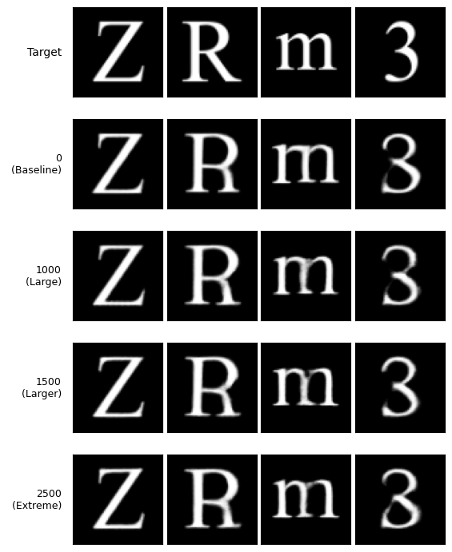

| L1 損失權重（n=4） | SSIM 1   | LPIPS 1   | SSIM 2   | LPIPS 2  |
| ------------ | -------- | --------- | -------- | -------- |
| 0            | 0.831336 | 0.0713787 | 0.783599 | 0.116378 |
| 1000         | 0.825302 | 0.0735024 | 0.793949 | 0.105613 |
| 1500         | 0.823885 | 0.0759716 | 0.796881 | 0.106816 |
| 2500         | 0.822372 | 0.0741480 | 0.794162 | 0.106696 |

這個發現是令人驚喜的！因為在前人的研究中\[5] \[6] \[8] \[10] 皆須採用 L1 損失主導或是相等權重的配置來約束生成結構（如 RAC-Font [10] 將其 L1 損失的權重設為對抗損失的 100 倍），但本研究卻能直接捨去並得到很好的結果。我們意識到這個差異可能是由 WGAN-GP 架構帶的提升，推測原因是傳統 GAN 的 JS 散度在結構錯誤時容易導致梯度消失，而 WGAN-GP 使用的 Wasserstein 距離則能提供持續的梯度回傳，自然地引導模型修正幾何結構，從而降低了對 L1 損失的依賴，這在其他研究中是尚未提到的有價值發現。

### 評估跨語言字體生成之可行性

由於中文字體訓練樣本天然的就比英文多（對於本研究英文僅 62 個英數，中文則挑選了常見的約 180 個部首或簡單字）且漢字中相同結構重複使用的情況非常普遍，使的「同步變換增強」能在相同的結構出現時發揮極好的效果。[7]

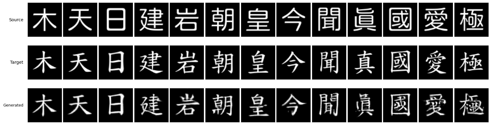

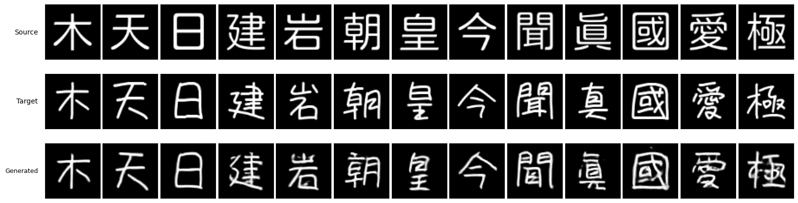
左側「木、天、日」為訓練集代表字，效果與英數字集相同，模型皆能完全模仿。「岩、朝、皇、聞」四字，雖出現少數筆畫風格不完全相符與模糊的現象但整體結構並無錯誤，其原因是這些字符的各部件皆出現在訓練集中故模型得以重複套用。另外，「建、今、國」三字，推測則是因為訓練集中有相似筆畫或本身筆畫較單純所以其效果也較佳。「愛、極」兩字，因結構較特別（訓練集中從未出現）且筆畫較密集，故出現嚴重模糊或結構錯誤的情況，推測這也跟一開始選擇的圖片尺寸過小有關，這是未來必須改善的問題。此外 RAC-Font [10] 提出的針對細部筆畫結構做額外訓練的方法或許也是值得借鑑的。

## 結論

### WGAN-GP 架構的高穩定性
本研究成功驗證了 WGAN-GP 在字體生成任務中的高度穩定性。相較於傳統 GAN 易發生的梯度消失、模式崩塌生成模糊等問題，WGAN-GP 透過 Wasserstein 距離與梯度懲罰機制，確保了判別器在訓練全程皆能提供有效的梯度指引。這不僅使的模型得以在無 L1 損失輔助下自我修正結構，更為後續的瓶頸層與資料增強實驗提供了穩定的基礎架構。

### 同步變換增強的邊界效應

「同步變換增強（Sync. Aug.）」被證實能有效提升模型對陌生字符的泛化能力。然而，增強參數存在明顯的「甜蜜點（Sweet Spot）」，過度的變換會導致結構裁切，形成誤導性的無效數據（Invalid Data）。此外，隨機遮罩與旋轉變換在字體生成任務中被證明效果不顯著甚至是具負面影響的。

### 瓶頸層空間維度是結構完整性的關鍵

相對於認為應將特徵壓縮至 1×1 以提取純粹特徵的觀點，但本研究透過 t-SNE 與 Linear Probe 探針實驗說明 1×1 的過度壓縮會導致空間位置資訊的流失（或高頻細節缺失），進而引發結構崩塌或字符混淆。實驗顯示，在不使用 U-Net 或其他輔助的情況下，單純地將瓶頸層放大至 4×4 或 8×8 在「特徵抽象化」與「空間對應性」之間即能取得很好的平衡。

### 損失函數與架構的連動關係

瓶頸層與模型的架構設計直接影響了損失函數的配置策略。當瓶頸層保留了足夠的空間資訊（如n≥4 ），並透過 WGAN-GP 架構的 Wasserstein 距離引導模型時，可不須再依賴 L1 像素損失來鎖定結構。這允許我們能夠移除 L1 損失的權重，從而避免了 L1 造成的模糊（Blurry）現象，使生成圖像在結構準確的同時保有銳利的筆畫細節，相較前人的研究須添加 L1 損失是令人驚喜且有價值的發現。

### 跨語言生成的潛力與限制

本研究的方法在英文與數字資料集驗證成功後，遷移至中文字體生成亦展現了高度可行性。利用漢字部件重複比例較高的特性，模型能透過學習部首與結構來推論未見過的漢字，實現少樣本生成的目標。不過受限於目前的圖像解析度（64×64)，在處理筆畫極度密集或結構複雜的漢字（如「愛」）時，仍存在筆畫沾黏或細節模糊的物理限制。

## 參考資料
[1]
Goodfellow, I. J., Pouget-Abadie, J., Mirza, M., Xu, B., Warde-Farley, D., Ozair, S., ... & Bengio, Y. (2014). Generative adversarial nets. _Advances in neural information processing systems_, _27_.

[2]
Radford, A., Metz, L., & Chintala, S. (2015). Unsupervised representation learning with deep convolutional generative adversarial networks. _arXiv preprint arXiv:1511.06434_.

[3]
Arjovsky, M., Chintala, S., & Bottou, L. (2017). Wasserstein generative adversarial networks. In _International conference on machine learning_ (pp. 214-223). PMLR.

[4]
Gulrajani, I., Ahmed, F., Arjovsky, M., Dumoulin, V., & Courville, A. C. (2017). Improved training of wasserstein gans. _Advances in neural information processing systems_, _30_.

[5]
Isola, P., Zhu, J. Y., Zhou, T., & Efros, A. A. (2017). Image-to-image translation with conditional adversarial networks. In _Proceedings of the IEEE conference on computer vision and pattern recognition_ (pp. 1125-1134).

[6]
Tian, Y. (2017). _Zi2zi: Master Chinese Calligraphy with Conditional Adversarial Networks_. Github. https://github.com/kaonashi-tyc/zi2zi

[7]
Wen, C., Pan, Y., Chang, J., Zhang, Y., Chen, S., Wang, Y., ... & Tian, Q. (2021). Handwritten Chinese font generation with collaborative stroke refinement. In _Proceedings of the IEEE/CVF winter conference on applications of computer vision_ (pp. 3882-3891).

[8]
Chen, X., Xie, Y., Sun, L., & Lu, Y. (2022). Dgfont++: Robust deformable generative networks for unsupervised font generation. _arXiv preprint arXiv:2212.14742_.

[9]
Pathak, D., Krahenbuhl, P., Donahue, J., Darrell, T., & Efros, A. A. (2016). Context encoders: Feature learning by inpainting. In _Proceedings of the IEEE conference on computer vision and pattern recognition_ (pp. 2536-2544).

[10]
Lee, J. S., & Choi, H. C. (2024). One-shot font generation via local style self-supervision using Region-Aware Contrastive Loss. _Journal of King Saud University-Computer and Information Sciences_, _36_(4), 102028.

[11]
Zeng, J., Chen, Q., Liu, Y., Wang, M., & Yao, Y. (2021, May). Strokegan: Reducing mode collapse in chinese font generation via stroke encoding. In _Proceedings of the AAAI conference on artificial intelligence_ (Vol. 35, No. 4, pp. 3270-3277).

[12]
Goldfeld, Z., & Polyanskiy, Y. (2020). The information bottleneck problem and its applications in machine learning. _IEEE Journal on Selected Areas in Information Theory_, _1_(1), 19-38.