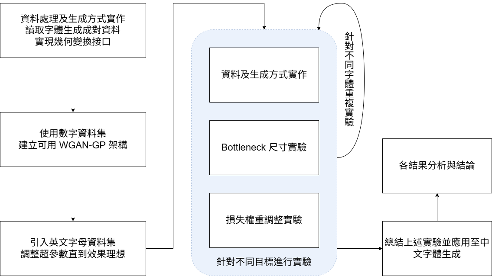
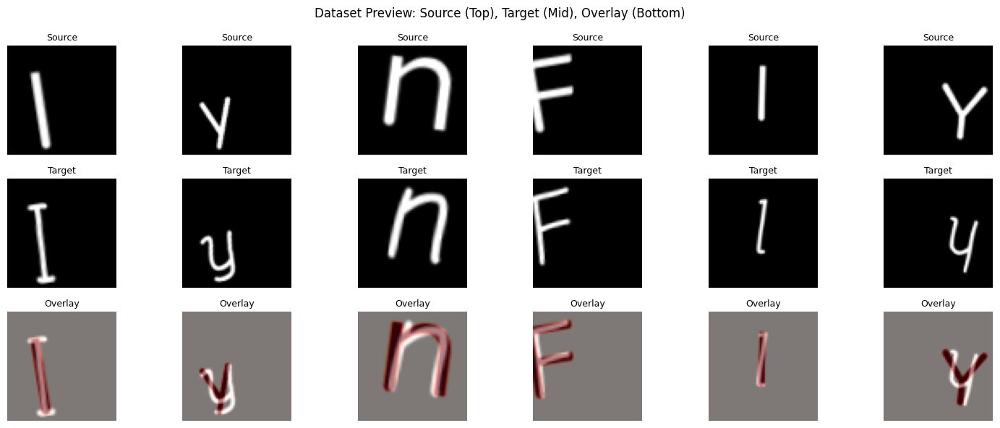
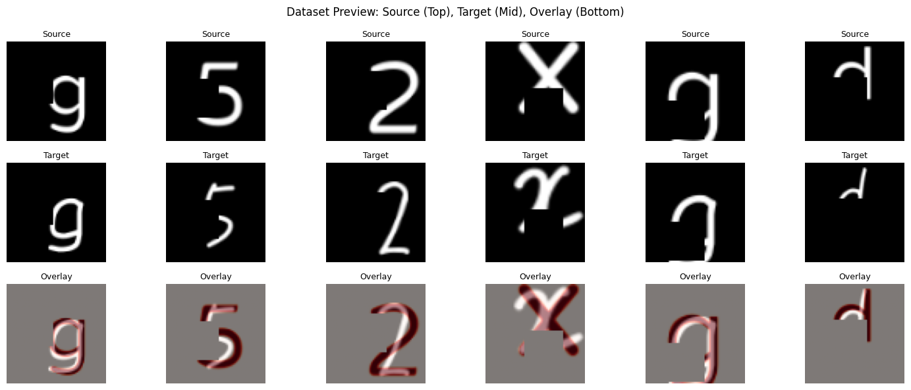
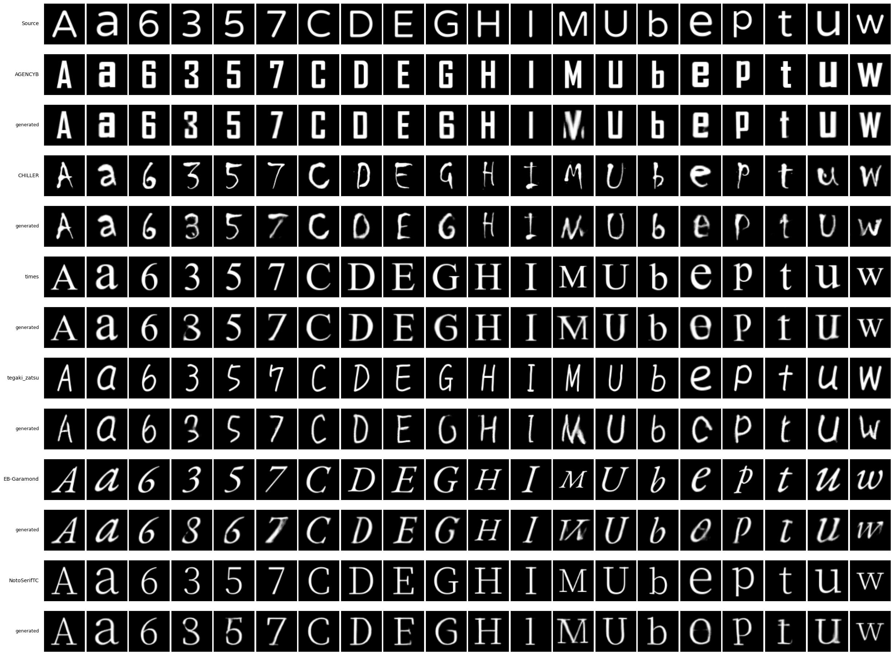
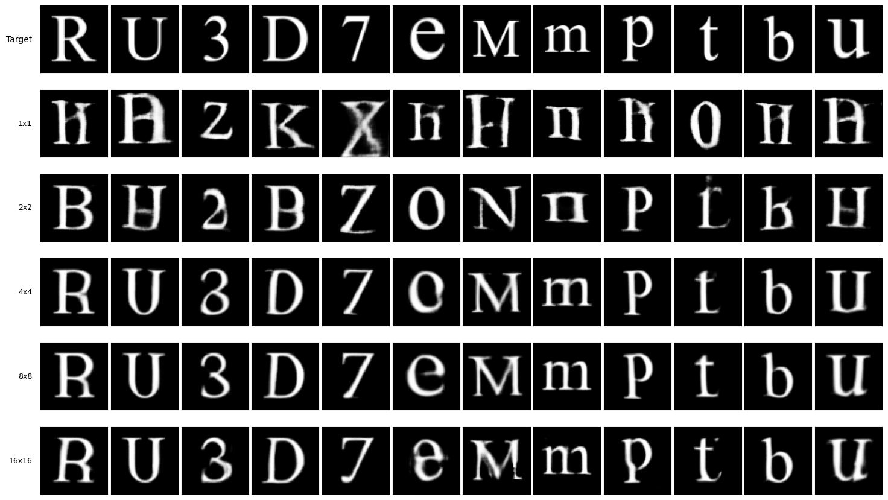
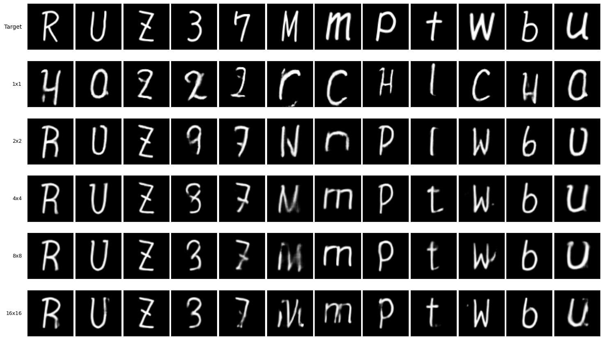
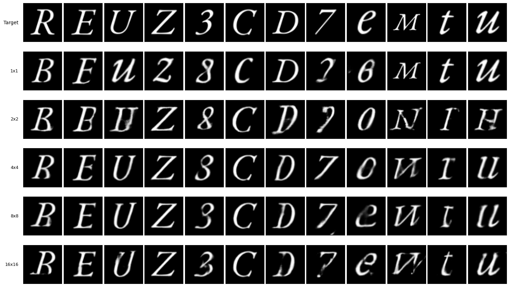
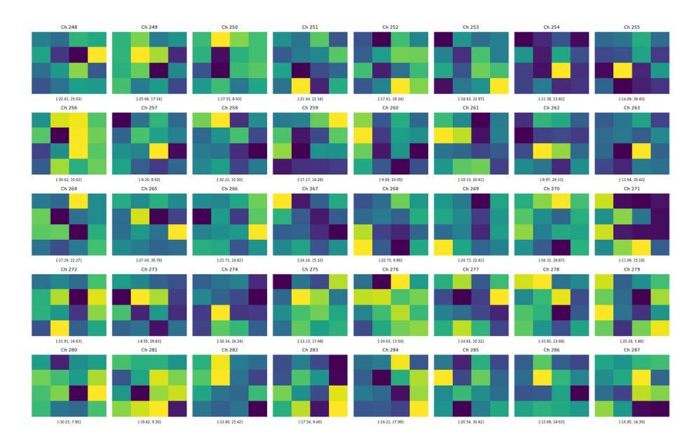
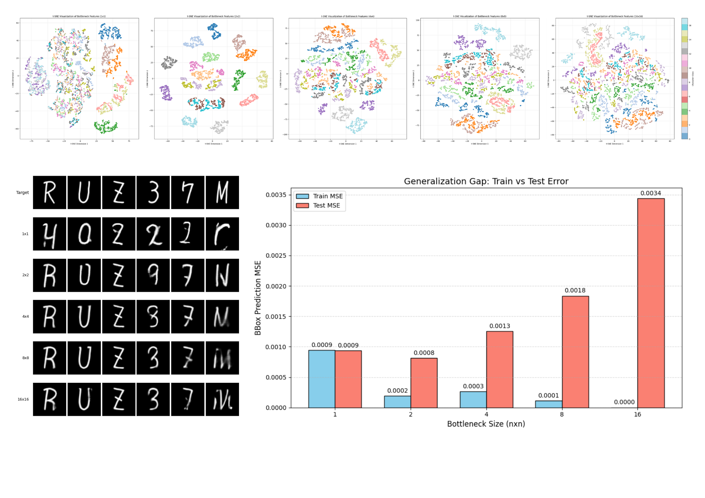
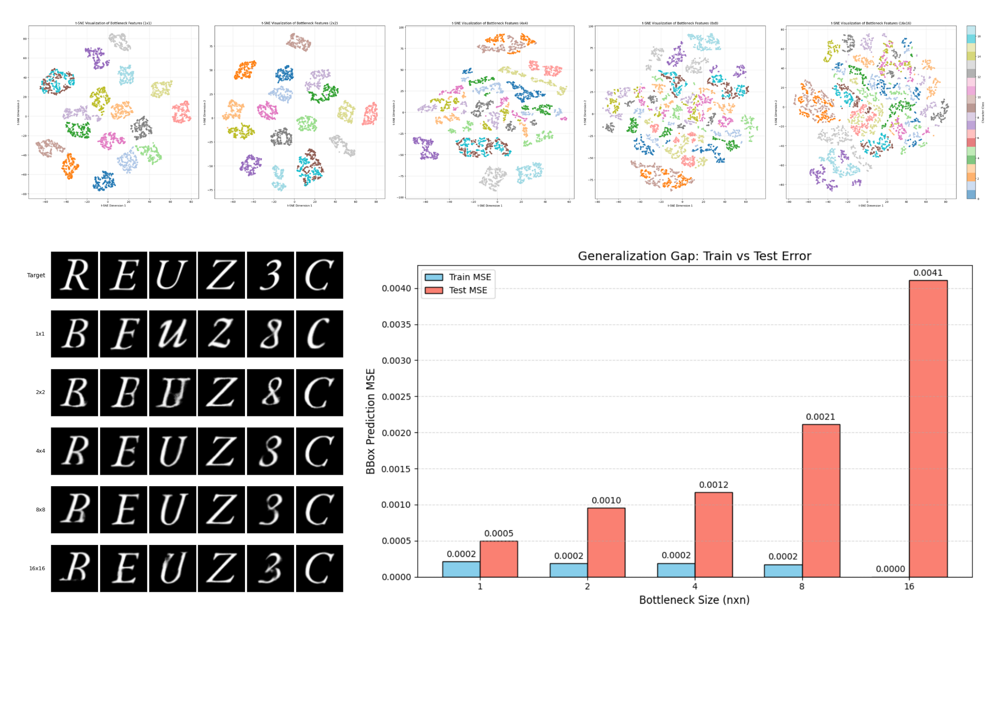

# 基於 WGAN-GP 的字體風格遷移研究

## 研究動機

自從 ai 大模型問世造成轟動，我一直對相關領域有著極大的興趣。在訓練手法上，我尤其對生成對抗網路（Generative Adversarial Network,GAN）的設計著迷。其藉由兩個神經網路（生成器 Generator, 與判別器 Discriminator）進行對抗學習，能有效解決傳統損失函數難以量化圖像「風格」與「真實感」的問題。

恰巧近年來，隨著技術的進步以及設計個人化需求的增加，市面上及社群軟體討論中出現了多種英文字體的生成工具@。透過這些工具，使用者只需手寫 26 個字母及數字，便能自動生成完整的個人化字體。

然在中文漢字領域卻鮮少看到類似的應用工具，應是因為漢字筆畫結構複雜、字數龐大等特性，若要求使用者手寫數千個常用字（約為 4000 字）才能生成字體，實用性將大幅降低。因此，如何透過少量的手寫樣本生成風格一致的完整中文字體，成為了一個值得探索的技術挑戰。

於是我決定嘗試開發一個實用的中文字體生成流程，讓一般使用者也能在僅需要書寫少量文字（目標1000 字以下）的情況下就能生成屬於自己的字體。

考量到中文字體生成的難度，研究初期將以英文與數字作為實驗對象，深入研究 GAN 的運作原理與架構設定，並嘗試不同的資料處理及增強方式。未來規劃將實驗歸納之結論，進一步應用於中文字體的生成任務中，以降低個人化中文字體的製作門檻。

## 目的

### 1. 建構基於 WGAN-GP 的字體生成模型

探討並實作 WGAN-GP（Wasserstein GAN with Gradient Penalty） 架構，以此解決傳統 GAN 在訓練過程中容易產生的模式崩塌（Mode Collapse）與梯度消失（Gradient Vanishing）問題，建立一個穩定且高品質的字體圖像生成架構。

### 2. 探討資料前處理與增強技術對泛化能力的影響

分析不同的數據增強策略（如幾何變換、隨機遮罩）對模型學習成效的影響。本研究將探討在缺乏部分成對訓練資料的情況下，如何透過資料增強處理，幫助模型學習字體的筆畫結構而非單純記憶像素，進而提升對陌生字符的生成品質。

### 3. 分析生成器瓶頸層（Bottleneck）特徵維度對生成效果之影響

研究生成器網路中「瓶頸層（Bottleneck）」的特徵圖尺寸對輸出結果的影響。探討在資訊壓縮過程中，不同程度的壓縮如何影響生成字體的結構完整性、筆畫細節、清晰度與風格還原效果，並試圖找出最佳的特徵維度設定。

### 4. 最佳化損失函數權重配置

探討像素損失（L1 Loss）與對抗損失（Adversarial Loss）之間的權重平衡。分析不同的權重如何影響生成字體的結構完整性、筆畫細節、清晰度與風格還原效果，解決字體生成中常見的模糊或結構扭曲問題。

### 5. 評估跨語言字體生成之可行性

以英文與數字作為對照，驗證最佳化後的模型架構是否能遷移至結構更為複雜的中文漢字字體生成任務。評估在「少樣本（Few-shot）」情境下，模型是否能依據少量的中文字樣本，推論生成風格一致的其他漢字。

## 設備

### 硬體

Google colab L4 GPU @

NVIDIA GeForce RTX 3050 Ti Laptop GPU (筆電)
12th Gen Intel(R) Core(TM) i7-12700H CPU (筆電)

### 軟體

Python 3.12.12 (colab)
Pytorch 2.9.0+cu126 (colab)
PIL 11.0.0 (colab)

Python 3.10.0 (筆電)
Pytorch 2.6.0+cu118 (筆電)
PIL 11.3.2 (筆電)

## 文獻探討

### ■ 文獻探討敘述方式

> 如果有空我要把它寫成 GAN本身的發展
> GAN 在圖像生成的應用以及優勢
> 漢字自體生成相關的研究
> 可能有個小結

### 生成對抗網路 (Generative Adversarial Network,GAN)

是非監督式學習的一種方法，其架構由一個生成器與一個判別器組成。生成器接受噪聲或是其他輸入，目標是輸出近似訓練集中真實樣本的資料。判別器則同時接收真實樣本與生成器產生的樣本，並嘗試區分兩者。透過生成器與判別器之間的對抗式訓練，兩個網路不斷調整參數，最終使生成器能夠生成與訓練資料分佈相近的樣本。

### WGAN（Wasserstein GAN）

原始的 GAN 中，判別器使用 JS 散度（Jensen-Shannon Divergence）作為評分，當生成結果分佈與真實樣本分佈不重疊時梯度無法給出有意義的評分，容易發生模式崩塌等問題。WGAN 即是基於原始的 GAN，修改判別器的評分方式改使用 Earth-Mover (EM) 距離來衡量真實分佈與生成分佈的差異。即使兩個分佈不重疊，EM 距離仍能提供有意義的梯度，引導生成器持續學習。

### WGAN-GP (Wasserstein GAN with Gradient Penalty)

為了滿足 Wasserstein 距離所需的 1-Lipschitz 連續性限制，WGAN-GP 摒棄了早期 WGAN 直接裁切權重（Weight Clipping）的做法（該做法易導致參數兩極化），改為在損失函數中加入梯度懲罰項，確保判別器的梯度範數維持在 1 附近，顯著提升了訓練的穩定性與收斂速度。故本研究選擇其作為模型基礎架構。

### Pix2pix （Image-to-ImageTranslationwithConditionalAdversarialNetworks）

Pix2pix 是一種 Conditional GAN（CGAN），用於圖像和圖像之間的映射。他有著 CGAN 的特色，會依據輸入的圖片進行生成，而不是單純透過雜訊向量進行訓練。因此 Pix2pix 的架構能夠在輸入圖片的基礎上進行訓練。他的其中一個特色是 U-Net 結構，將模型的第 i 層和第 n-i 層直接連接起來，確保輸入圖片和生成圖片在各不同維度的相似性。
他是經典的成對影像轉換方法，其透過一個權重結合條件式 GAN 與 L1 損失以同時保留結構與風格，此權重也是本研究要討論的一個部份。

### [zi2zi](https://kaonashi-tyc.github.io/2017/04/06/zi2zi.html)

是一個基於 pix2pix 並將其應用在中文字體生成的實踐。其特點有：同時學習多種字形，將字形的配對不侷限在字體 A 對字體 B，而是多樣的將所有字體配對成成對資料集做為預訓練。為了解決一對多字形配對帶來的矛盾，其新增了一部份的高斯雜訊作為樣式嵌入。不過本研究則專注在 GAN 模型本身的調整以及字體變形，將字體生成視為一個風格轉換任務，並沒有使用預訓練資料對模型進行訓練。

### [Handwritten Chinese Font Generation with Collaborative Stroke Refinement](https://openaccess.thecvf.com/content/WACV2021/papers/Wen_Handwritten_Chinese_Font_Generation_With_Collaborative_Stroke_Refinement_WACV_2021_paper.pdf)

其引入了粗體分支解決過細的筆劃容易在訓練過程丟失的問題，並利用自適應預變形，複用中文字中的重複結構，使訓練資料（微調資料）降到 750 個字。本研究引入的同步變換增強即是參考自此篇研究。

### 小結

本研究考慮到 GAN 在圖像生成的優勢以及他的不穩定性，決定使用 WGAN-GP 這個較為穩定的架構進行實作。並參考前人的研究，使用 Pix2pix 的編解碼器以及雙損失函數（l1 & 對抗損失）架構，但決定專注在 GAN 模型本身的可能性探討，故沒有採用其使用的 U-Net 架構。另外也在 zi2zi 中看見了中文字體生成的可行性，但改將字體生成視為一個一對一的風格轉換，沒有使用預訓練資料進行多對多的字體訓練。最後則從 Handwritten Chinese Font Generation with Collaborative Stroke Refinement 中得到了同步變換增強的參考基礎。

## 方法及過程

### ■ 判斷好壞標準

> 可能需要一個介紹自體生成好壞判斷標準的東東
> 像是 整體結構 筆畫輕細度 風格相似度 (皆為主觀)
> 再丟去判別器或 L1距離 (較客觀)

### 研究流程

1. 資料集生成製作
2. 以數字做嘗試，建立可用的 WGAN-GP 架構
3. 引入英文字母，並透過 GAN 文獻經驗尋找效果恰當的超參數
4. 針對不同的研究目標（資料處理/瓶頸層/損失權重），控制其他變因進行實驗
5. 針對相同的目標，使用不同字體進行實驗
6. 總結上述實驗並應用至中文字體生成
7. 總結所有實驗
   

### 模型架構

本研究建立了一套基於 WGAN-GP 的生成對抗網路架構，旨在解決傳統 GAN 在訓練時時常見的梯度消失（Vanishing Gradient）以及模式崩塌（Mode Collapse）等問題，整體架構分為生成器（Generator）與判別器（Discriminator）兩大核心組件，詳細設計如下：

#### 1. 生成器（Generator）

生成器採用「編碼器-解碼器 (Encoder-Decoder) 結構」，目的在於學習從來源字體圖像（Is）到目標字體圖像（It）的非線性映射。

##### 編碼器（Encoder）

由多層卷積層（Convolutional Layers）組成。每一層進行下採樣（Downsampling），逐步壓縮特徵圖的空間解析度（Spatial Resolution）並增加特徵通道數（Channels），並使用 LeakyReLU 作為激活函數。此過程旨在提取字體的筆畫結構與幾何特徵。

##### 可變的瓶頸層（Adjustable Bottleneck）

編碼器後連接瓶頸層，其指的是經過編碼器壓縮後的潛在空間。傳統上會將此層設置為 1x1，也就是說讓編碼器將輸入壓縮成一個 1x1 的特徵向量，本研究則將此層的尺寸(n x n)設為可調整的變因，將在後續進行討論。此外，為了使生成器有更大的操作空間，我們在此層將特徵向量與同樣大小的高斯噪聲張量 z 進行拼接 (Concatenation)

##### 解碼器（Decoder）

由多層轉置卷積層（Transposed Convolution）組成。將瓶頸層的特徵圖逐步上採樣（Upsampling）回原始圖像大小。層與層之間同樣採用採用 ReLU 激活函數以取得更明確的特徵，最後一層輸出經由 Sigmoid 函數映射至 [0,1] 區間即是生成的字體灰階圖像。

#### 2. 判別器（Discriminator）

使用標準的 WGAN-GP 判別器，最後一層設計為不使用激活函數，直接輸出一個純量分數（Scalar Score），代表輸入樣本與真實分佈的 Wasserstein 距離估計值。
並在損失函數中加入梯度懲罰項，約束真實樣本與生成樣本之間插值的梯度範數（Gradient Norm）

#### 整體架構流程

生成器的輸入僅為來源圖片，經過若干卷積採樣層進行特徵抽取與壓縮，最後映射至大小為 n×n 的瓶頸層（Bottleneck）。在瓶頸層中嵌入相同尺寸的噪聲張量 z，以提供生成器操作空間，再由解碼器（Decoder）層逐步採樣回原始圖片大小。
生成器輸出的圖像與對應目標圖像同時作為判別器的輸入計算對抗損失，同時也透過 L1 距離（L1 Distance）衡量生成圖像與目標圖像之差異。最終總損失由對抗損失與 L1 損失組成，透過設定的權重進行平衡，以同時兼顧生成品質與逼真度。

此外本研究在資料處理階段引入了同步變換增強（Sync. Aug.）將在下方詳細敘述。

### 資料來源與處理

#### 字體來源

本研究選用以下字體，其挑選原則為盡量包含多種風格，且變化程度從低到高皆有包含為主。

#### 資料集產生

讀取來源字體和目標字體後，透過 pillow 套件繪製於畫布上，將其縮放至 64x64 的尺寸，調整為背景黑色（０），文字白色（1），並經過同步變換增強後生成一個一一對應的資料集。

#### 主動分割測試集

為了驗證模型的泛化能力並避免過度擬合（Overfitting）本研究也主動將字符集劃分為「訓練集」與「測試集」。訓練階段僅使用特定的字符（如主動移除資料集中的 A、E、I、G、Z 等隨機字符），以模擬中文資料集不會包含所有文字的情況，並用以評估模型是否真正學會了「風格遷移」而非單純記憶圖像。

#### 動態生成機制

本研究的資料集使用動態生成 (On-the-fly Generation) 而非預先將訓練資料儲存成靜態圖片。在訓練時時透過 `__getitem__` 動態渲染。此機制不僅大幅節省硬碟空間，更允許在每一個 Epoch 對同一字符施加不同的隨機增強效果，使模型在整個訓練週期中從未看過完全相同的兩張圖片，相比預先生成所有資料並在每一輪重複讀取資料量大幅提升資料量。

### 幾何變換增強

考量手寫字體在真實書寫時具有高度的隨機性，本研究引入幾何變換增強。其關鍵在於採用同步變換（Synchronized Transformation）操作，即對來源圖（Source）與目標圖（Target）施加完全相同的變換參數，以維持兩者結構的對應關係。此操作由以下參數配置：

#### 縮放 (Scaling)：

模擬字體大小的變化，其值為一個數對（Smin,Smax）代表縮放的最小和最大比例。

#### 平移 (Translation)：

模擬文字在方格內的位置偏移，其值為一個數對(Tx,Ty)，代表圖片在 x 和 y 軸的最大偏移比例（相對圖片大小計算，例如偏移 0.5 即代表有一半的圖片偏移出畫布）。

#### 旋轉 (Rotation)：

模擬書寫時的傾斜角度，其值為一個正數（$θ$）代表傾斜範圍（$±θ$ 度）。

透過幾何增強，預期能擴增可用的數據量，讓模型遇到類似的結構能夠套用類似經驗，也避免過擬合現象發生。

同步變換增強示意圖

### 隨機遮罩增強 (Random Masking)

為了增強可用的資料量，本研究參考去噪自動編碼器（Denoising Autoencoder）的概念，引入隨機遮罩機制。在訓練過程中，以固定機率 $P_{mask}$ 對輸入圖像及目標圖像隨機遮蔽一塊矩形區域（將像素值設為背景色）。此舉同樣是為了讓缺少的資料能有更多樣的變化。

隨機遮罩示意圖

者兩個增強方式皆包含在同步變換增強這個模塊中。

### 可變瓶頸層

一般研究建議瓶頸層設為1x1，但本研究則將瓶頸層尺寸設為實驗變因，探討在 n x n （ｎ=1,2,4,8,16）的尺寸設定下對生成品質的影響。

#### 模型架構一致性

在模型的控制變因上，本研究遵守「架構一致性策略（Architectural Consistency）」，亦即固定模型的卷積層數，並依照相同的下採樣邏輯（當空間解析度隨下採樣減半時，特徵通道數（Channels）相應翻倍，持續下採樣直到瓶頸層尺寸達到目標尺寸後不再下採樣。

卷積模型 Encoder 架構，以 n=4 為例，其經過四次下採樣後即不再下採樣

#### 參數量差異

此架構雖已經盡量保持一致，但模型在參數量仍有不同，以下附上各瓶頸層尺寸的模型生成器的參數量（Parameters）

| Bottleneck size | Trainable params (Generator) |
| --------------- | ---------------------------- |
| 1x1             | 17,432,272                   |
| 2x2             | 20,889,120                   |
| 4x4             | 24,291,008                   |
| 8x8             | 28,389,888                   |
| 16x16           | 13,741,440                   |

### 損失函數設計

為了兼顧生成圖像的風格真實感與文字結構的正確性，本研究參考前人研究，令生成器 $G$ 的總損失函數 $\mathcal{L}_{G}$ 由對抗損失與像素重建損失兩部分加權組成。

#### 1. 對抗損失 (Adversarial Loss)

對於生成器而言，其目標是最小化生成圖像被判別器 （Discriminator,D）評分為「假」的程度（即最大化判別器分數）。其損失函數定義為：
$$ \mathcal{L}_{\text{adv}} = -\mathbb{E}_{z, I*{s}} [D(G(z, I*{s}))] $$
其中，$z$ 為隨機噪聲，$I_{s}$ 為來源字體圖像，$G(z, I_{s})$ 為生成的偽造圖像。
_註：為了維持 WGAN 的 1-Lipschitz 限制，判別器 $D$ 的訓練過程額外包含梯度懲罰項 (Gradient Penalty)，其完整損失為 $\mathcal{L}_{D} = \mathbb{E}[D(G(z, I_{s}))] - \mathbb{E}[D(I_{t})] + \lambda_{gp}\mathbb{E}[(||\nabla_{\hat{x}} D(\hat{x})||_2 - 1)^2]$。_

#### 2. L1 像素重建損失 (L1 Reconstruction Loss)

為了確保生成的文字在筆畫結構與空間位置上與目標字體保持一致，且避免模型僅追求抽象的風格相似，引入 L1 距離作為內容約束。此項計算生成圖像與真實目標圖像 $I_{t}$ 之間像素值的絕對誤差平均值：
$$ \mathcal{L}_{\text{L1}} = \mathbb{E}_{I*{s}, I*{t}} [ || G(z, I_{s}) - I_{t} ||_1 ] $$
此損失項能提供明確的梯度指引，加速模型收斂並防止字形嚴重扭曲。

#### 3. 總目標函數 (Total Objective Function)

綜合上述兩項，生成器的總損失函數定義如下：
$$ \mathcal{L}_{\text{Total}} = \mathcal{L}_{\text{adv}} + \lambda*{L1} \cdot \mathcal{L}*{\text{L1}} $$
其中，$\lambda*{L1}$ 為權重超參數（Hyperparameter），用於調節「風格遷移（由 $\mathcal{L}*{\text{adv}}$ 主導）」與「內容保留（由 $\mathcal{L}_{\text{L1}}$ 主導）」之間的平衡。

## 實驗結果與討論

### 訓練結果

### ■ 損失曲線

> 要不要放個經典的 WGAN-GP 曲線 但我找步道
> 然後說一下訓練豪穩定

### 生成結果

如圖可發現模型在訓練集（圖片中靠左的 3 個字符為例）皆能完美的模仿目標字體。在測試集中則受不同字符、字體的影響效果有差異，不過只有部分字符（Ｍ、ｅ等）會出現結構上的錯誤，其他生成結果皆可辨識且與目標具有明顯的風格相似。

### 同步幾何變換對泛化能力以及生成效果的影響

研究發現縮放變換在一定的範圍有正面影響，但若放大過大導致資料中白色色塊過大會導致生成效果不佳出現結構不精準的情況。而縮放倍率太小則會造成太細的筆劃容易被忽略。

平移變換的結果與縮放類似，在合理範圍皆能顯著提高生成結果，但若移動後導致字符過多的部分被裁切形成無用數據也會帶來負面影響。

無用數據示意圖

旋轉變換的效果是不顯著的，在一些情況甚至會帶來負面影響，其原因應該是因為兩種字型之間偏移的方向理論上是固定的（例如目標字型筆畫收尾會往上偏）但在旋轉後會使得訓練資料中有些筆畫末端會變成偏左或右，推測這種矛盾的現象會帶來負面影響。
而某些字體會有橫向筆畫較細，直向筆畫較粗的特性，此時若加入旋轉也可能會導致模型混淆橫豎筆畫的粗細關係。

### 隨機遮罩對泛化能力以及生成效果的影響

發現隨機遮罩僅帶來負面效果，原因應是模型誤將遮罩截斷的地方視為筆畫末端進而影響模型對於筆畫收尾方式的理解，或是因為兩字體的偏移導致遮罩僅甚遮住其中一個字體，發生生成的字筆畫嚴重缺失的情況。

錯誤遮罩示意圖

### 瓶頸層（Bottleneck）尺寸對生成效果之影響

傳統瓶頸層設計傾向使用 1x1 的特徵圖以最大化語義壓縮@@，但在訓練過程中發現到1x1的特徵會導致模型失去對結構的理解。在前兩組字體中甚至出現了結構錯誤以及身份混淆（Character Identity Confusion）的現象（例如將 U 繪製成 0 或 A 、3 繪製成 2）。

本研究測試了 1x1 至 16×16 等多種解析度，實驗結果顯示 4x4 及 8x8 的尺寸達到了最佳平衡點。它既能有效地進行特徵抽象化（Feature Abstraction），又能保留必要的空間位置資訊（Spatial Correspondence）。為了客觀驗證此發現，本研究嘗試透過一系列實驗，深入分析瓶頸層的空間保留能力，並解釋 1x1 架構在結構生成上失效的根本原因。

這邊有參考@@

#### 特徵圖視覺化

首先，我們直接將瓶頸層輸出的特徵圖進行視覺化。

發現瓶頸層的特徵圖呈現類似雜訊的分佈，無法直接辨識出與字體的關聯。這證實了深層卷積網絡已將輸入圖像編碼為高度抽象的特徵（Abstract Features），導致我們無法直接解讀其中的空間對應關係。因此，必須借助更進階的分析工具進行驗證。

#### 空間資訊遮蔽測試

除了觀察其抽象特徵外，本研究也嘗試直接遮蔽瓶頸層部分區塊，以確認 n>1 時瓶頸層的確各自攜帶了字體筆畫的位置資訊。

發現 n>1 時，瓶頸層的確攜帶了一定的位置資訊，不過其攜帶的位置解析度及範圍在 n=2 及 n=8 的情況並沒有明顯差異。

#### 特徵降維分群測試

參考 [The Information Bottleneck Problem and Its Applications in Machine Learning](https://arxiv.org/pdf/2004.14941) 的研究，我們推測是 1x1 的瓶頸層過度壓縮了圖片，導致資訊缺失。
由於本研究聚焦於圖片生成而非分類，於是僅參考該研究中的降維概念，決定採用 t-SNE（t-Distributed Stochastic Neighbor Embedding）降維技術對特徵做處理並分系，此工具能夠將高維度的特徵向量映射至二維平面，並保持樣本間的局部鄰近關係。

具體而言，我們將生成器瓶頸層輸出的 n×n×C 特徵圖展平（Flatten），透過 t-SNE 投影後觀察不同字符的特徵分佈。若同一字符的樣本在二維平面上能夠聚集成簇（Cluster），則代表模型成功學會了區分不同字符的特徵。反之若雜亂無章，則代表資訊在壓縮過程中流失過多。

#### 線性探針測試

為了進一步量化模型對「幾何結構」的理解，我們引入了 Linear Probe 測試。此方法常用於自監督學習，旨在探測凍結的特徵層中是否隱含了顯性的空間資訊。

具體而言，我們凍結（Freeze）生成器的編碼器參數，並在其瓶頸層輸出後附加一個簡單的線性回歸層（Linear Layer）並進行訓練。該探針的任務是僅憑瓶頸層特徵，預測輸入字體的邊界框座標（Bounding Box, $[x_{min},y_{min},x_{max},y_{max}]$ )
若此線性層能夠準確預測出文字的位置與大小（即驗證集 MSE 誤差低），則說明瓶頸層中確實保留了一定的**空間幾何資訊（Spatial Information）**。反之若誤差極高，則說明空間資訊在壓縮過程中被破壞。

#### 測試結果

綜合前兩項觀察可做出「瓶頸層的確在把輸入壓縮提取特徵時攜帶了一定的位置資訊」，在此基礎上進一步解釋分群實驗以及 linear probe 測試，對於在生成結果出現的字符結構錯誤甚至身份混淆的前兩個字體中（以第一張分析圖做代表），可對應到其 t-SNE 分群中 n=1 時的分群失敗現象，在 linear probe 測試中也能發現其 MSE 值也是略高的。這足以說明在前兩組字體中 1x1 的瓶頸層的確造成了資訊的過度壓縮以及省略，導致其生成效果非常的不理想。

不過對於第三組字體（第二張分析圖）來說，1x1 的瓶頸層並沒有帶來明顯的結構錯誤，對應的其分群效果和 linear probe 測試成績在 n=1 時也並沒有比 n>1 時的情況較差。

總的來說，此兩個測驗能夠說明部分字體在瓶頸層為 1x1 時生成效果較差的情況（字體一、二），也能夠說明當瓶頸層過大（n>=8）時效果較 n<8 時較差的原因（其分群效果較差且在 probe 測試出現過擬合現象）。但對於部分字體卻無法完全解釋 1x1 較 2x2 或 4x4 生成效果較差的原因。

針對上述「測試成績與生成品質不一致」的現象，我們提出以下解釋：
n=2 時在 Linear Probe 的優異表現，可能源於 Linear Probe 的過度簡單化，使的回歸層能容易的從 2x2 的特徵層提取出「邊界框」這個同樣為二維的特徵（可從空間資訊遮蔽測試得知）。同樣的， T-SNE 測試中最終只需要歸類為 2 個維度來區分字符，這對 2x2 的瓶頸層來說應也是容易且較少干擾的。
相較之下從 4x4 或 8x8 的特徵中提取邊界框可能會有較多雜訊，但我們認為它其實保留了更詳細的筆畫位置資訊，當使用更深層的解碼器生成圖片時即能夠被解析，使最終生成效果最為自然且結構完整。

#### 模型層數差異

由於控制變因的選擇造成 4x4 的參數量大於 1x1 的參數量，為了排除參數量造成的影響故本研究針對 n=4 的情況進行了模型層數的調整，進一步確認影響結果的原因。

可以發現當層數降至 4 層時（此時參數量已遠小於 n=1,6層 ）生成效果並沒有顯著降低。這說明了單純追求模型的深度並不能解決結構精準度的問題，合理的空間維度保留是維持結構完整性的關鍵。

### 最佳化損失函數權重配置

研究發現，在瓶頸層尺寸為 1x1 時，不添加 L1 損失會造成模型最終輸出一個符合目標字體但與來源字體無關的圖像（模式崩潰），提高 L1 損失權重可改善此情況（但其結構以及筆畫細節仍不穩定）。
而當瓶頸層尺寸變大後，模型能更直接的取得筆畫的實際位置，使的此時即便不添加 L1 損失也不會發生模式崩潰的情況，此時添加過多的 L1 損失則會造成經典的模糊現象@
總結來說，若提高瓶頸層後可直接不使用 L1 損失，即可獲得理想的生成結果。

### 評估跨語言字體生成之可行性

由於中文字體訓練樣本天然的就比英文多（對於本研究英文僅62個英數，中文則挑選了常見的約 180 個部首或簡單字）且中文的同樣結構重複使用的情況非常普遍，使的「同步變換增強」能在相同的結構出現時發揮極好的效果，唯當出現訓練集無類似結構的來源圖片時較容易發生結構錯誤的情況。另外對於一些較為複雜的字（例如：愛）一開始設定的圖片尺寸過小容易造成部分筆畫黏貼重疊的情況，是必須改善的一點。

左側「木、天、日」為訓練集代表字，其他效果較好的有「岩、朝、皇、聞」四字，其各部件皆出現在訓練集中，另外「建、今、國」推測是因為訓練集中有相似筆畫或本身筆畫較單純所以效果也不錯。不過像是「愛」這樣筆畫較短、密集且方向變化大的字就容易出現模糊的情況。

## 結論

### 同步變換增強的邊界效應

「同步變換增強（Sync. Aug.）」被證實能有效提升模型對未見字符的泛化能力。然而，增強參數存在明顯的「甜蜜點（Sweet Spot）」，過度的變換會導致結構裁切，形成誤導性的無效數據（Invalid Data）。此外，隨機遮罩與旋轉變換在字體生成任務中被證明效果不顯著甚至具負面影響。

### 瓶頸層空間維度是結構完整性的關鍵

傳統認為應將特徵壓縮至 1x1 以提取純粹語義，但本研究透過 t-SNE 與 Linear Probe 探針實驗證實 1x1 的過度壓縮導致了空間位置資訊的流失，進而引發結構崩塌或字符混淆。實驗顯示，4x4 至 8x8 的瓶頸層尺寸在「特徵抽象化」與「空間對應性（Spatial Correspondence）」之間取得了最佳平衡。這個觀點在研究中是較少見的。

### 損失函數與架構的連動關係

瓶頸層的設計直接影響了損失函數的配置策略。當瓶頸層保留了足夠的空間資訊（如n≥4 時，模型不再依賴 L1 像素損失來鎖定結構。這允許我們降低甚至移除 L1 損失的權重，從而避免了 L1 造成的模糊（Blurry）現象，使生成圖像在結構準確的同時保有銳利的筆畫細節，相較前人的研究必須添加 L1 損失是令人驚喜的發現。

### 跨語言生成的潛力與限制

本研究的方法在英文與數字上驗證成功後，遷移至中文字體生成亦展現了高度可行性。利用漢字部件重複的特性，模型能透過學習部首與結構來推論未見過的漢字，實現少樣本生成的目標。惟受限於目前的圖像解析度（64x64)，在處理筆畫極度密集或結構複雜的漢字（如「愛」）時，仍存在筆畫沾黏或細節模糊的物理限制。

## 參考資料
