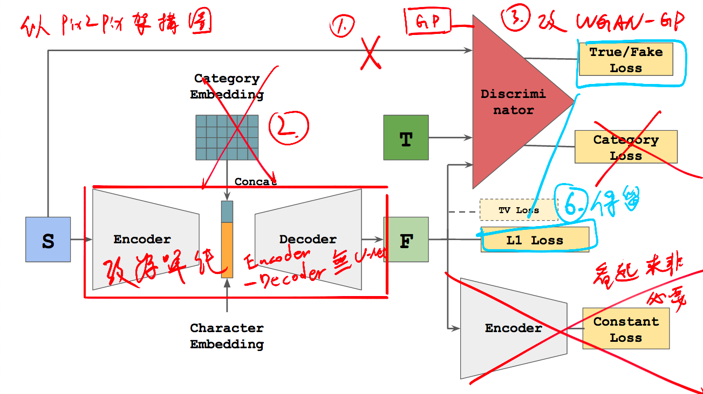
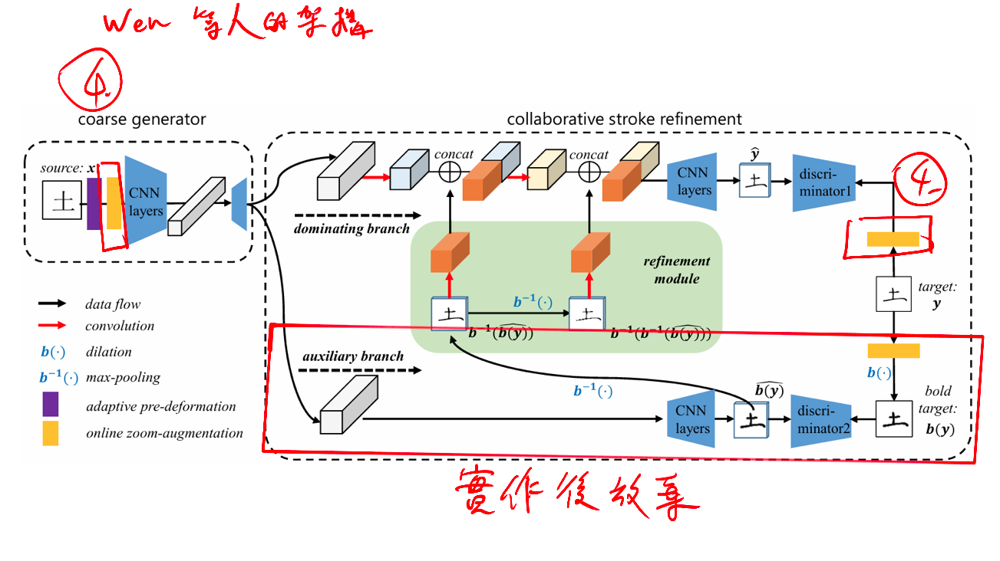
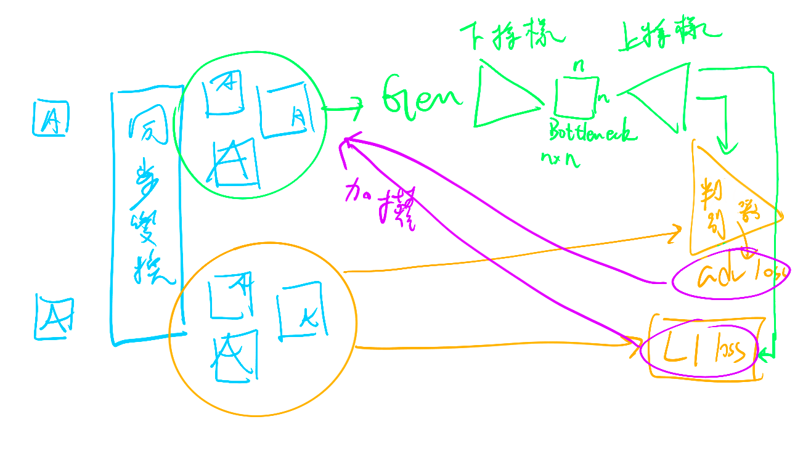

## 本週回顧
在亂七八糟的實驗中 模型架構基本上是確定了
整理修改時的想法
基本上採用一個 能省則省的態度

| **架構決策**             | **動機與說明**                                                                                                            | 目前看起來的效果      |
| -------------------- | -------------------------------------------------------------------------------------------------------------------- | ------------- |
| **1. 判別器非條件式化**      | **回歸獨立風格判斷：** 移除判別器的條件式輸入，使其專注於分析生成樣本是否符合目標字體特徵，而非比對輸入圖。                                                             | 不確定是否影響       |
| **2. 移除類別編碼**        | **回歸一對一轉換**：反正就是我只在乎兩個字體 A to B，生成器和判別器不需要知道他們分別是哪種字體                                                                | 必須保留 目前無負面影響  |
| **3. 導入 WGAN-GP 架構** | **強化訓練穩定性：** 將損失函數替換為帶有梯度懲罰（Gradient Penalty）的 WGAN 架構。解決傳統 GAN 常見的梯度消失與模式崩塌問題。                                      | 很有用的感覺        |
| **4. 同步變換增強**        | **提升泛化與空間一致性：** 透過對輸入與輸出樣本進行同步的幾何變換（如旋轉、縮放），進而強化模型處理未知樣式的能力。                                                         | 很有用的感覺        |
| **5. 移除 U-Net 跳躍連接** | **深入瓶頸層特徵分析：** 捨棄 Skip-connections 以切斷編碼器與解碼器間的捷徑。強制資訊通過瓶頸層，讓我們能專注探討潛在空間（Latent Space）對字形語義的壓縮與表達潛力，並探討 WGAN-GP 的潛力。 | 待確認，但似乎沒有負面影響 |
| **6. 維持雙損失函數**       | **維持雙損失函數**：聽起來很有道理，留著                                                                                               | 待確認           |
## 重要進展

這張圖是從 zi2zi 擷取 但非完整 zi2zi2 架構而是偏向 pix2pix 架構
捨去非必要的東西並做了圖中1、2、3、6這幾個設計

這是 wen 等人的架構圖
實作後放棄粗體輔助分之
選用其同步變換增強(online zoom-augmentation)的操作，但實現方法不同(改為純隨機變換)

大致架構圖
## 研究方向計畫
針對表中尚未確定影響的變因進行實驗

---
@J - Week 14
