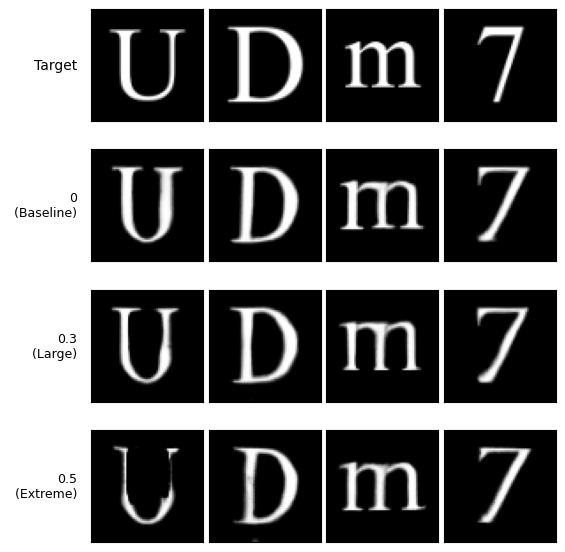
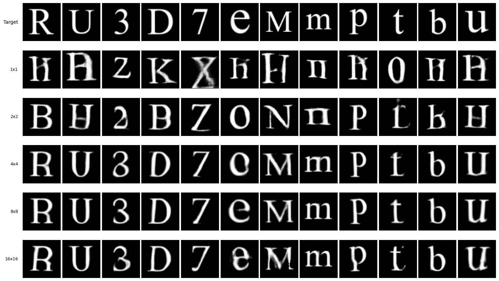

## 本週回顧
暑假休息完後
要來對所有變因進行嚴謹的討論了
但發現到之前偏直覺嘗試的檔案多到爆炸，本來以為我會記得那是做啥用的，現在都混在一起了全都要重跑，所以想了一個用 UID 把執行檔跟權重檔關聯起來的方法。
每次下載 pth 檔案包含那個 id 
之後搜尋 ID 就能秒找檔案。

之後開始系統性分析 基本上大致趨勢都與之前實驗中發現的相同
## 重要進展
UID 關聯方式
```python
print("\n" + "="*30)
print("準備存檔...")
print("="*30)

import time, random, string

RUN_ID = time.strftime("%Y%m%d_%H%M%S") + "_" + ''.join(random.choices(string.ascii_lowercase + string.digits, k=4))

print("RUN_ID:", RUN_ID)

# --- 1. 定義檔名 (使用 cfg 的參數) ---
model_filename = f"gan_G_n{cfg.bottleneck_size}_l1_{int(cfg.lambda_l1)}_l_{cfg.fixed_layers}_{RUN_ID}.pth"

checkpoint_filename = f"checkpoint_n{cfg.bottleneck_size}_l1_{int(cfg.lambda_l1)}_l_{cfg.fixed_layers}_final_{RUN_ID}.pth"

# --- 2. 儲存輕量化模型 (僅 Generator 權重) ---
# 用途：生成圖片

torch.save(G.state_dict(), model_filename)
print(f"1. 模型權重已儲存: {model_filename}")

# --- 3. 儲存完整檢查點 (Checkpoint) ---
# 用途：接著繼續訓練，分析訓練過程的 Loss 記錄

checkpoint = {
    'config': cfg.__dict__,         # 將 Config 物件轉成字典存入，這很重要！
    'total_epochs': cfg.num_epochs, # 記錄總共訓練了多少輪
    'G_state_dict': G.state_dict(),
    'D_state_dict': D.state_dict(),
    'opt_G_state_dict': opt_G.state_dict(),
    'opt_D_state_dict': opt_D.state_dict(),
    'loss_history': history    # 訓練過程的 Loss 曲線數據
}

torch.save(checkpoint, checkpoint_filename)
print(f"2. 完整檢查點已儲存: {checkpoint_filename}")

# --- 4. 觸發瀏覽器下載 ---
...

# === 輸出

RUN_ID: 20260415_030551_8op9 
1. 模型權重已儲存: gan_G_n8_l1_0_l_5_20260415_030551_8op9.pth 
2. 完整檢查點已儲存: checkpoint_n8_l1_0_l_5_final_20260415_030551_8op9.pth 
3. 正在嘗試自動下載...
```


透過 .pth 檔案生成圖像進行比較

針對同步變換增強結論如下
縮放配置於 0.7~1.35 有較佳效果
其餘範圍皆會使生成效果下降

平移配置在 0.35 有較佳效果
但提升至 0.7 左右皆不會有明顯的效果下降

旋轉則沒啥用的感覺 

遮罩則會出現嚴重錯誤 應該是因為兩種字形筆畫沒有完全對應 遮罩會遮錯(像是某些筆畫只有 A 字體被遮到)



---


瓶頸層則是發現 1x1 2x2 效果不好 應該是因為過度壓縮 需要後續進行分析

## 研究方向計畫
進一步分析瓶頸層


---
藍翊庭 - Week 39
