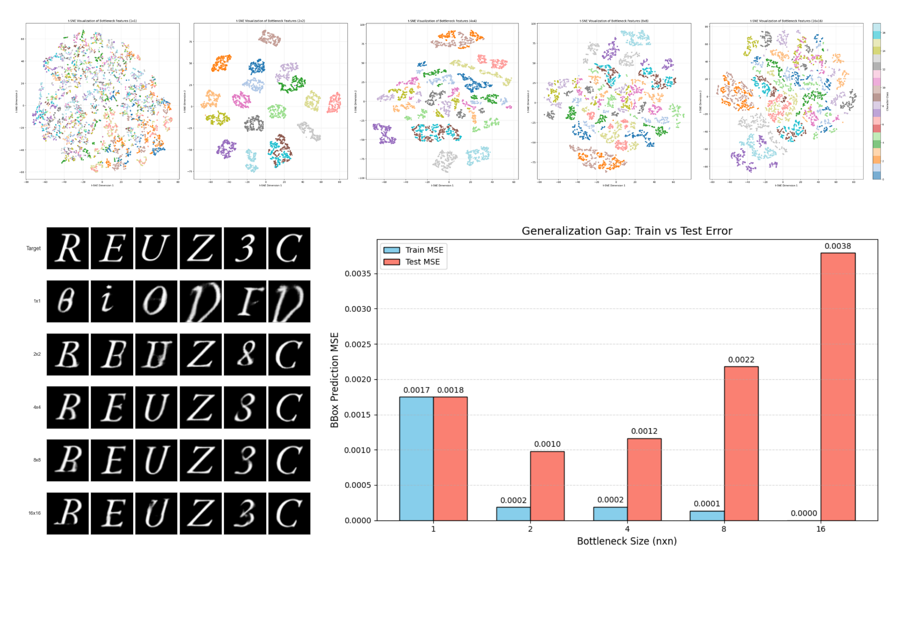

## 本週回顧

## 重要進展

**【初步觀察與問題意識】**  
在初步評估不同瓶頸層尺寸的生成結果時，我觀察到一個明顯的現象：當瓶頸層尺寸縮減至 1x1 時，生成的字體會出現嚴重的結構錯誤；而 4x4 與 8x8 的尺寸則在量化指標與視覺表現上取得最佳平衡。為了客觀解釋這個現象，決定設計一系列實驗，深入探討模型內部的運作機制。

**【實驗零：印出來看看】**
總之我把瓶頸層的特徵直接印出來 但啥都看不出來

**【實驗一：空間特徵對應測試】**  
首先，我推測瓶頸層的空間維度與最終生成的圖像有著直接的對應關係。為此，我進行了遮蔽實驗（Masking），將瓶頸層特定區塊的特徵值清零。結果如預期，生成的筆畫確實出現了對應區域的缺失。
但 2X2 8X8 的瓶頸層卻沒有明顯的差異(幾乎無差異)
這初步證實了瓶頸層確實掌管了字體的空間結構，但仍無法解釋為何不同尺寸間會產生如此大的品質差異。

**【實驗二：基於文獻的特徵群聚分析】**  
繼續查相關的瓶頸層與特徵壓縮論文。
有一篇 [13_Information-Bottleneck_2004.14941v2](../re/ref/13_Information-Bottleneck_2004.14941v2.pdf) 提到，模型在對資訊進行壓縮時，提取出的特徵是否能在空間中形成良好的「群聚（Clustering）」，是判斷特徵品質的重要依據。  

基於這個理論，假設 1x1 尺寸表現差是因為「資訊過度壓縮」。
為了驗證這一點，我們引入 t-SNE 技術對瓶頸層特徵進行降維分析。
結果證實了猜想：在 1x1 尺寸下，不同字符的特徵嚴重混雜，確實發生了過度壓縮；反之，當尺寸大於 8x8 時，分群效果同樣不理想。推測，這是因為過大的空間無法有效精煉資訊，反而保留了過多無用的雜訊。
不過 2x2 的瓶頸層卻意外地獲得了最佳的效果

**【實驗三：幾何結構保留能力測試】**  
為了進一步確認結構資訊的保留程度，在 ai 建議下參考了表徵學習領域常用的 Linear Probe 測試。我在瓶頸層後方添加了一個簡單的線性迴歸層，試圖直接用這些特徵來預測字體的邊界框（Bounding Box）。  
測試結果顯示而過大的瓶頸層則出現了明顯的過擬合現象——這意味著大尺寸雖然「死背」了位置，卻沒有將資訊轉化為有利於模型後續泛化的特徵。
但 2x2 的成績仍然較優

推測 2x2 的優良成績其實是來自測試過於簡單 不須用到一些更精細的特徵
但生成字體時就會需要那些特徵了

## 研究方向計畫
瓶頸層變因暫時先到這邊 

---
藍翊庭 - Week 47
