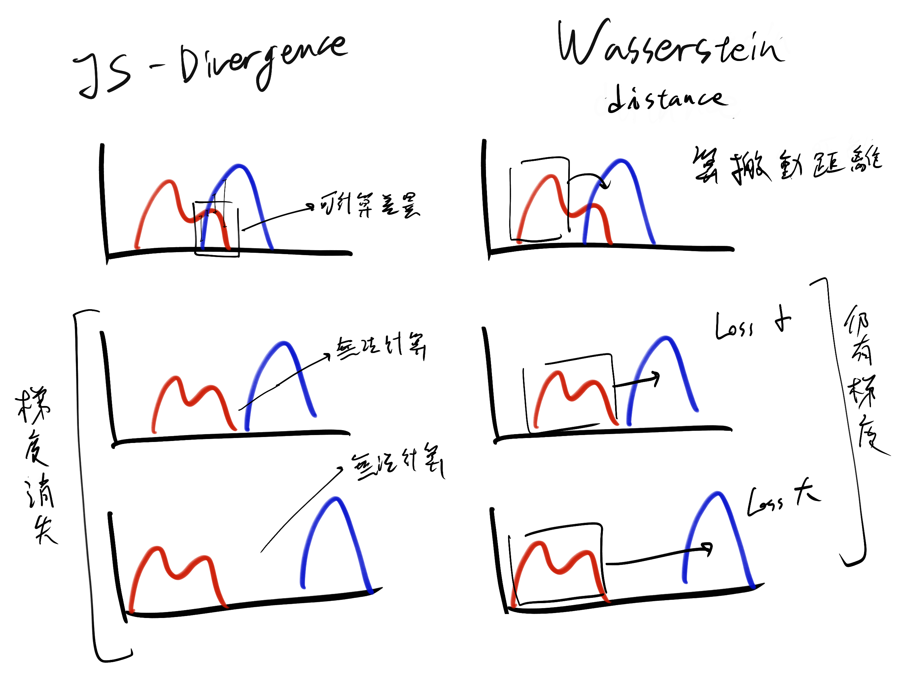
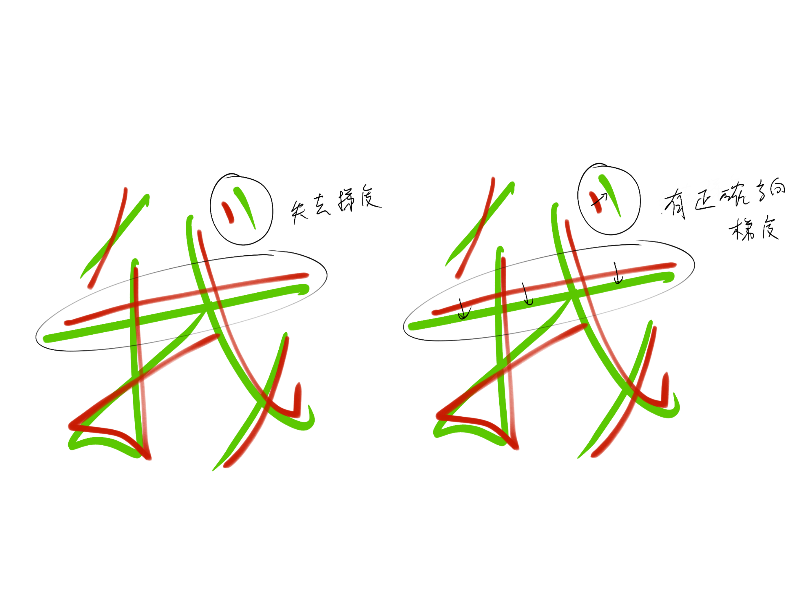

## 本週回顧

## 重要進展

**【文獻回顧與預期現象】**  
回顧 pix2pix 等影像風格轉換的相關文獻，L1 損失（像素級絕對誤差）通常被視為不可或缺的條件，主要用於強力約束生成圖像的幾何結構，避免在對抗學習中發生結構崩壞。
因此，實驗初期的預期是：必須維持一定比例的 L1 損失權重，才能確保生成的字體筆畫不發生錯位。

**【實驗觀察與異常發現】**  
在針對不同瓶頸層尺寸進行權重調整時，實驗數據呈現出兩極化的發展。  
當瓶頸層設定為 1x1 時（此時空間資訊嚴重遺失），提高 L1 損失權重確實能有效拉回錯誤的字體結構，表現與過去文獻的預期一致。

然而，當瓶頸層設定為 4x4 時，L1 損失卻開始產生負面效益，其平均化像素的數學特性導致生成的字體邊緣出現模糊與平滑化現象。

**【假設提出與測試】**  
基於前項針對瓶頸層的分析，4x4 的尺寸已能妥善保留筆畫的空間位置資訊。由此衍生出一個大膽的假設：在空間特徵保留完整的前提下，模型是否已經不需要依賴 L1 損失來強制對齊結構？  
為了驗證此推論，隨後的實驗將 L1 損失完全移除，僅依賴判別器的對抗損失來指導生成器。

**【結果分析與機制推導】**  
實驗結果取得了突破性的進展：在完全移除 L1 損失後，生成圖像不僅維持了正確的幾何結構，且字體邊緣的清晰度大幅提升，徹底排除了原先的模糊副作用。

進一步深究此現象背後的運作機制：重新檢視模型基礎架構，推測這必須歸功於 WGAN-GP 所採用的 **Wasserstein 距離** （因為沒有其他變因了）。

在傳統 GAN 架構中，若生成圖像的結構與目標圖像落差過大，往往會面臨梯度消失的問題，因此必須依賴 L1 損失提供明確的修正方向。然而，W 距離的數學特性使其即使在真實分佈與生成分佈極度不重疊（例如結構嚴重錯位）的情況下，依然能計算出連續且有意義的梯度。

(圖中標註無法計算應為可計算但僅會輸出一個常數 log2)

推測 Wasserstein 距離引導結構的原理
## 研究方向計畫

---
@J - Week 50
