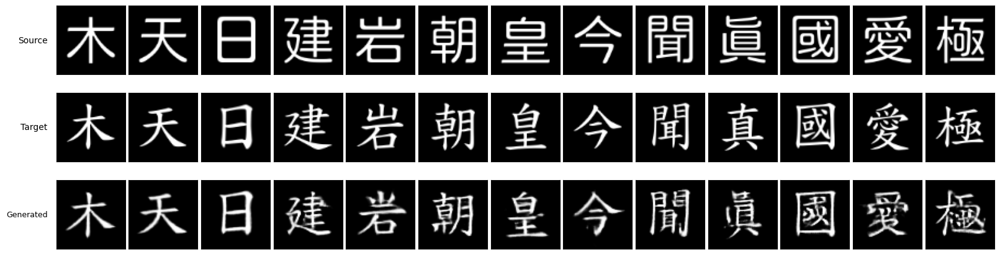

## 本週回顧
只能說最近趕報告書
又出現一堆問題真的太亂了
紀錄都沒有詳細寫好
所以全部寫在這篇整理一下

發現的問題
1. 有些舊的資料中，訓練集設定竟然是不同的，要重跑
2. t-sen 測試中，字符的標籤設定錯誤，使結果不明顯，且變換參數設定與訓練時不符，要重做
3. 原本使用的中文字體有缺字或使用異體字的情況 要重做 然後重測
4. 原本 lpips 的測試方法不能直接用在中文 資料量太大會炸掉 要改成隨機抽取

處理情況
1. t-sen 重作後沒有改變數據趨勢
2. 製作字體檢查工具，順利找到可用中文字體
3. 中文的部分部分指標蠻讚的 不過實際看起來的效果其實沒有特別驚豔
4. 量化測試也成功修正 但運用新方法測試英文字體時分數反而較低 故仍使用測試資料較多的原先方法（應用少量變換增強提升測試資料量及隨機性)

## 重要進展
確認了中文的量化測試成果 提升作品說明書完整性

補完整過程紀錄：
**【資料集檢驗與自動化清理】**  
在近期與學長針對生成結果進行深度檢討時，發現一個潛在的資料源頭問題：原先採用的來源字體資料集中，存在部分缺字以及異體字（例如圖示中的「真」字寫法異常）。  

由於本研究的模型高度依賴來源與目標圖像的幾何對應關係進行學習，這些異常的字形或缺漏，會直接誤導模型，使其學習到錯誤的筆畫結構與映射邏輯。
我們緊急實作了一套「自動化字體檢查腳本」。透過此腳本自動比對並篩除缺字與異常字形，目前已成功將訓練資料全面替換為高品質、無缺漏的中文字體集，確保模型學習目標的準確性。

**【評估體系之擴充與補全】**  
在與指導老師們的討論中，確認了目前研究在「量化評估」面相的不足。初期研究主要聚焦於英文字體的量化分析，而對於中文字體生成，考量到筆畫複雜度高且缺乏統一基準，多依賴視覺評估。  
A
然而，為提升研究結論的客觀性與學術嚴謹度，後續必須將中文字體的量化測試納入實驗標準。此外，在重新檢視評估指標的完整性時，發現先前遺漏了 GAN 領域中極為核心的評估標準——**FID（Fréchet Inception Distance）**。後續實驗將一併實作 FID 指標，與現有的 SSIM、LPIPS 結合。

**【技術落地與未來應用展望】**  
在探討模型的實際應用價值時，學長提出了一個極具建設性的延伸方向：「書法字帖的修復」。  
此提議為本研究的技術落地提供了一個極具文化保存價值的應用場景，可作為未來後續研究的重要推進方向。

## 研究方向計畫
持續撰寫作品說明書
檢查過去資料

---
@J - Week 55
